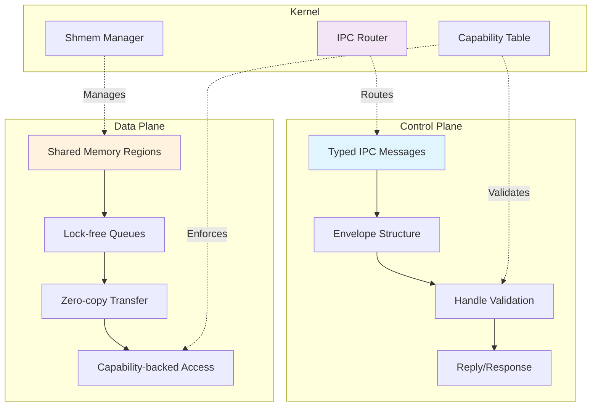
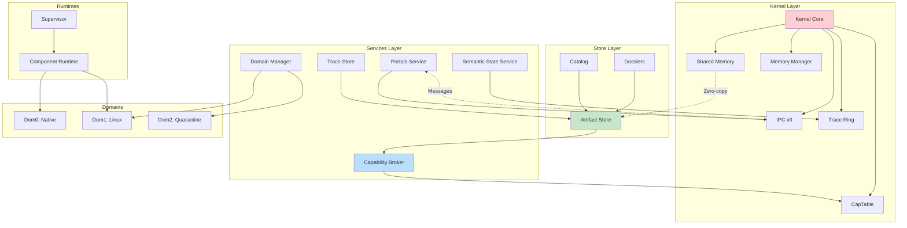
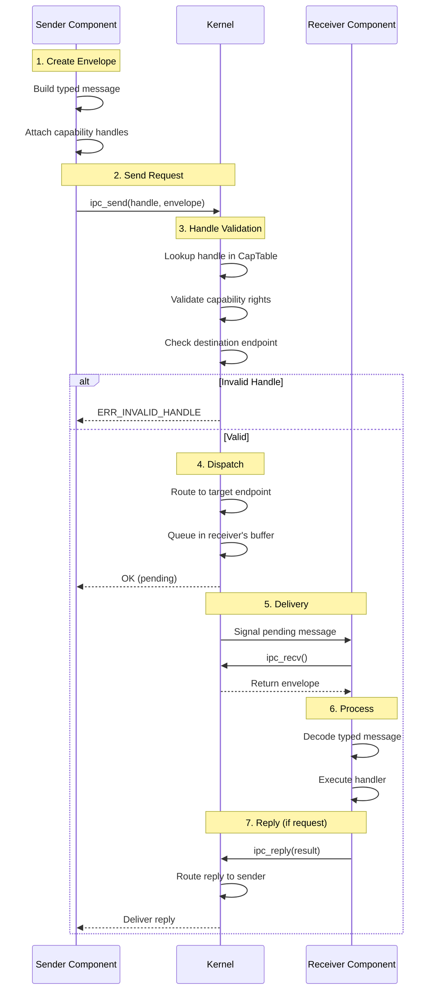
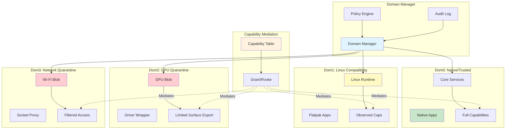
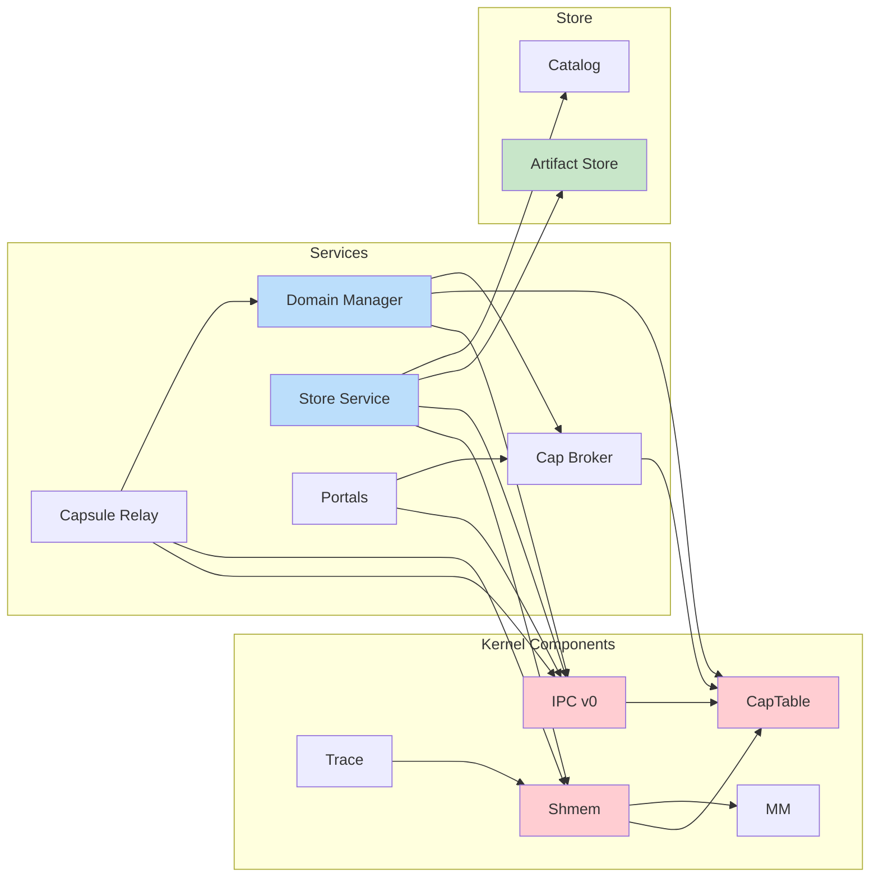

# PLATFORM_OVERVIEW
Platform Overview: OS Core + Foundry + Store

## 0. Purpose
This project builds the first true **AI-Native, post-Unix operating system**. It is designed for an era where AI agents write code, manage infrastructure, and act on behalf of users. It achieves this by:
- replacing human-emulation (screen scraping, raw TTYs) with structured Semantic State APIs,
- replacing dangerous ambient authority with strict Capability Budgets (zero-trust by default),
- isolating drivers and high-risk stacks into quarantined domains,
- industrializing hardware support via an AI-augmented Driver Foundry,
- and migrating legacy software toward native APIs via a Store-driven porting ladder.

The platform is developed as three pillars:
1) OS Core (Kernel + Services + Runtimes)
2) Foundry (Trace→Replay→Fuzz→Minimize→Gate)
3) Store Platform (Run Now → Vote/Port → Publish)

Roadmap: see `ROADMAP.md` for execution sequencing and slice milestones.

## 1. Non-Negotiable Principles
### 1.1 Anti-Gravity Rules
- Native interfaces are typed harnesses/portals. No “escape hatch” interfaces that become de facto standards.
- Compatibility exists, but must never become the native development path.

### 1.2 Isolation First
- Drivers and complex subsystems run as user-space components.
- Quarantine Domains exist for “boss fights” (GPU, proprietary Wi-Fi, etc.).
- Tier-1 hardware requires IOMMU-class isolation enforcement.

### 1.3 Performance by Construction
- Control plane uses structured messages.
- Data plane uses zero-copy shared memory + queues.
- Capability validation for fast-path handoffs must be kernel-side and constant-time.

#### Control Plane vs Data Plane Separation

The diagram above illustrates the strict separation between:
- **Control Plane**: Typed messages through IPC for commands, configuration, and small data transfers
- **Data Plane**: Zero-copy shared memory for bulk data transfer, backed by capability-enforced access

### 1.4 Tooling: Rust + Python
- Kernel/core services: Rust-first.
- Tooling and orchestration: Python, backed by optimized Rust libraries.
- Other languages are allowed only in sequestered components/containers.

## 2. Major Components and Responsibilities

### System Architecture Overview

The architecture enforces the principle that **kernel ≠ services ≠ store** - each layer has distinct responsibilities and communicates through well-defined interfaces.

### 2.1 Kernel Core (Ring 0)
Responsibilities:
- Boot, memory management, scheduling primitives
- Capability handles and enforcement (fast-path validation)
- IPC primitives for control plane
- Shared memory primitives for data plane (zero-copy handles)
- Interrupts/timers, IOMMU programming, DMA isolation boundaries
- Minimal debug/trace emission to kernel ring buffer

Explicitly NOT responsible for:
- in-kernel driver stacks
- policy UI
- package management logic

#### IPC Message Flow

The IPC flow ensures:
1. **Kernel-side validation**: All capability checks happen in kernel, not user-space
2. **Typed envelopes**: Messages are structured with IDL-generated types
3. **Synchronous request-reply**: For control plane operations
4. **Async queuing**: Messages queue in receiver buffers when needed

### 2.2 Component Runtime (User-space substrate)
Responsibilities:
- Process/component lifecycle
- Supervisor: crash detection, restart, health
- Binding layer for IDL-generated harness stubs

### 2.3 Core Services (User-space, policy-bearing)
These services form the “stable contract surface” for Store + Foundry.

#### a) Capability Broker (Policy + Grants)
- Evaluates policy and grants capabilities (handles) to components
- Maintains audit logs and revocation
- IMPORTANT: runtime fast-path checks happen in kernel; broker is for grant decisions, not per-packet validation

#### b) Portals Service (User-mediated access)
- File picker, clipboard, notifications, screen capture, devices
- One “native truth” for mediated access across native + compat apps

#### c) Domain Manager (Quarantine + Compatibility)
- Launches and monitors:
  - Linux Domain (for broad compatibility, including Flatpak)
  - Specialized Quarantine Domains (GPU blobs, proprietary stacks)
- Exposes exported harness endpoints to the host (e.g., Display Export)

#### Domain Isolation Model

Each domain operates with different capability sets:
- **Dom0**: Full native capabilities, trusted components
- **Dom1**: Observed capabilities, compatibility layer with monitoring
- **Dom2/Dom3**: Quarantine domains with severely limited, mediated access

The Domain Manager mediates all cross-domain communication through capability-backed channels.

#### d) Execution Fabric (Capability-scheduled execution)
- Grants or denies resource leases for execution requests
- Selects the runner, domain, and node for a canonical launch plan
- Deduplicates equivalent execution requests and attaches observers to existing executions
- Emits execution traces for lifecycle, runner, resource, and output outcomes
- Feeds compute-fabric state into the Semantic State Service

Execution Fabric is a policy/control service, not a runner. It may choose `native_wasm_v0`, `linux_vm_v0`, `gpu_quarantine_v1`, or future backends, but those runners remain separate implementations.

#### e) Artifact Store (Immutable, signed, rollback-friendly)
- Content-addressed storage for components, apps, traces, corpora
- Channels: Experimental / Candidate / Stable
- Supports atomic update and rollback primitives

#### f) Semantic State Service (Agent-first introspection)
- Produces structured state snapshots:
  - active components/domains
  - harness endpoints and stats
  - granted capabilities
  - compute-fabric nodes, resource leases, and execution state
  - performance counters (high level)
  - error conditions
- Produces structured Crash Context objects (component crash bundles)

#### g) Trace Store (Scenarios and protocol traces)
- Stores:
  - driver traces for replay/fuzz/minimize
  - app scenario traces (launch flows, portal interactions)
- Supports minimization input formats and replay runners

### 2.6 The AI-Native Interface (Agentic Substrate)
Legacy operating systems force AI to pretend to be human (moving virtual mice, reading pixels). RamenOS provides a native semantic layer for agents:
- **Semantic State Service:** Exposes the entire OS state (active components, granted capabilities, error conditions, and hardware topology) as structured, deterministic JSON/Markdown.
- **Capability Budgets:** When a user asks an agent to "edit my presentation," the OS grants the agent a temporary, single-use capability handle to *only* that file. Even if the agent hallucinates malicious instructions, the kernel's fast-path validation physically prevents it from accessing other data.
- **The Translating Shell:** The user interacts with the OS via natural language. The LLM translates this intent into explicit, typed IDL requests. The OS executes the mechanism; the LLM merely translates the policy.

### Component Relationships

The diagram shows dependency directions - services depend on kernel primitives, and the store provides storage capabilities to services. The kernel components have no dependencies on services or store, enforcing the layering principle.

### 2.4 Foundry (The AI-Augmented Assembly Line)
Foundry is a unified, industrial pipeline applied to both driver components (hardware traces) and app ports (scenario traces). We treat legacy systems as *behavioral oracles* to generate native Rust replacements.

**The Pipeline:**
1. **Oracle Capture:** A legacy Linux driver/app is spun up in a compatibility capsule. The Foundry records a `protocol_trace` (or `scenario_trace`) of its exact hardware/API interactions.
2. **The Reference Vault:** Agents ingest the trace alongside scraped vendor datasheets and Linux source snippets, creating a unified, pinned context window.
3. **Native Distillation:** An AI coding agent generates a native Rust component fulfilling the strict IDL Harness, using the Oracle's trace as the deterministic scoreboard. (Trace → Replay → Fuzz → Minimize → Gate).
4. **Hardware-in-the-Loop (HIL):** The distilled driver is deployed to the golden machine farm for continuous regression testing.

Outputs:
- Signed artifacts (Native WASM, Components)
- Trace corpora and minimized repros
- Conformance reports for harness versions

### 2.5 Store Platform (Package Intelligence + UX)
Responsibilities:
- Dossiers (deduped identity + evidence + action plans)
- “Run Now” UX with runner selection and permission preview
- Porting Queue with leverage-aware scoring
- “Port It Now” Wizard that produces publishable artifacts only after gates

## 3. Compatibility Strategy (Explicit)
Compatibility is a set of runners, not an identity:
- Linux Domain: maximum compatibility (including Flatpak apps)
- POSIX Personality: compatibility layer for rebuilding where viable
- WASI Runner: sandbox-friendly where applicable
- Native: portal/harness-first APIs

Migration is mandatory:
Anything that runs in compatibility mode should accumulate:
- observed capability profile
- scenario traces
- candidate tightened policies
- a path to graduate (wrapper → POSIX → native)

## 4. GPU Strategy (Divide and Conquer)
Phases:
1) Quarantine Domain renders; OS consumes exported surfaces
2) Native Display Scanout owned by OS (vsync/frame pacing)
3) Native Copy/Compute engines (zero-copy moves, simple submission)
4) End-state: vendor blob demoted to “compiler”; OS submits and preempts GPU work

## 5. Development Model: Vertical Slices with Hard Boundaries
We develop OS and Store simultaneously via vertical slices.
Each new OS capability must ship with:
- a minimal consumer,
- a Foundry replay gate,
- and an IDL-defined contract.

## 6. Release Channels and Promotion Rules
- Experimental: smoke + basic replay
- Candidate: scenario suite + minimization regressions
- Stable: extended replay corpus + fuzz budget + rollback validation
