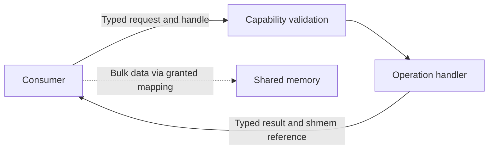

# Platform Overview

**Last Updated:** 2026-09-16
**Status:** Architecture reference with explicit implementation boundaries

RamenOS is an experimental Rust OS for agents, organized around OS Core,
Foundry, and the Store Platform. This document distinguishes implemented
components from the environment they are intended to form.

[Current Status](CURRENT_STATUS.md) records landed state;
[Next Tasks](NEXT_TASKS.md) owns execution order in the parallel hardware and
software lanes. [Roadmap](ROADMAP.md) is directional. A design responsibility
below is not evidence that a complete target runtime or security property exists.

## 0. Purpose and status vocabulary

The thesis is that agents should discover permitted state and act through typed,
capability-bounded interfaces. Foundry supplies evidence for individual behavior
and claim boundaries. Whether the composition helps an agent remains the
question for the planned [Agent Task Proof](docs/plans/2026-09-16-agent-task-proof.md).

Use these markers throughout this overview:

- **Landed:** the named implementation and bounded gate exist, in the stated
  host or target environment. This does not mean the whole component is complete.
- **Partial:** foundations exist, but a stated integration or enforcement path
  remains incomplete, simulated, or limited to fixtures.
- **Target architecture:** intended behavior without a complete demonstrated
  implementation. It is not a description of today's runtime.

## 1. Design invariants

These are requirements from [the Constitution](CONSTITUTION.md), rather than
claims that every path already satisfies the complete architecture:

- Native interfaces use typed Harnesses and Portals defined through IDL.
  Project policy forbids ioctl-style escape hatches; POSIX is compatibility-only.
- Kernel, services, and Store have distinct responsibilities. The kernel supplies
  mechanisms; user-space brokers decide grants. Fast-path capability validation
  belongs in the kernel.
- Typed messages carry control; shared memory carries bulk data. Zero-copy
  describes the intended data path, not a claim that every host bridge is copy-free.
- Drivers and high-risk stacks should run in isolated domains. Hardware-backed
  DMA/IOMMU isolation requires its own target evidence.
- Request authority (`Lang`) and observable authority (`ObsContract`) must be
  specified separately. A restricted request API alone does not establish
  noninterference or limit every observation channel.
- Kernel and core services are Rust-first; host tooling also uses Python.

The intended control/data separation is:

```mermaid
flowchart LR
    C[Consumer] -->|Typed request and handle| V[Capability validation]
    V --> H[Operation handler]
    H -->|Typed result and shmem reference| C
    C -.->|Bulk data via granted mapping| M[Shared memory]
```

This is a **target architecture** sketch. Landed kernel IPC/shared-memory gates
exercise selected paths; host services and bridges have separate enforcement
and transport implementations. It is not an inventory of a unified runtime.

## 2. Major components and responsibilities

### 2.1 Kernel Core (Ring 0) — Partial

**Landed, target/QEMU:** boot on x86_64 and aarch64; memory-management and
scheduling primitives; typed IPC; generation-counted capability handles;
shared-memory mappings; per-domain tracing. Kernel operations validate handle
kind, generation, domain/rights where applicable. The capability table is a
single-threaded prototype whose use after the SMP transition is deliberately
blocked. General SMP/IRQ support is not established.

Inspect [kernel](kernel/), [kernel API](kernel_api/), and the `just foundry-s0`
and `just foundry-shmem-dataplane-s8-phase4-integration` gates. These prove the
paths they exercise, not all service requests or production isolation.

**Target architecture:** the kernel owns fast-path enforcement and the minimal
memory, scheduling, IPC, interrupt, and DMA-isolation mechanisms. Grant policy,
package management, and user-facing policy belong outside it. Existing driver
and init bring-up paths are not proof that every driver already runs as an
isolated user-space component. IOMMU inventory/probe work is distinct from full
DMA isolation on physical hardware.

### 2.2 Component Runtime — Partial

**Landed, host:** [native_runner](services/native_runner/) uses Wasmtime and
generated host bindings, injects granted handles, and rejects missing required
capabilities. [runtime_supervisor](runtime_supervisor/) provides runner dispatch
and lifecycle scaffolding. Selected broker/proxy and framed QEMU IPC paths have
Foundry gates.

**Remaining:** Wasmtime, the full native runner, and the host service graph do
not run together on the target. Broad broker/kernel migration and a target
userspace runtime/loader remain work. Some supervisor grant paths are stubs;
choose and identify the actual bridge used in each experiment. See the
[S10.5 integration inventory](docs/plans/2026-06-17-s10-5-host-to-target-integration.md)
and `just foundry-qemu-ipc-bridge-s10-5-2`.

**Target architecture:** components launch with explicit grants, observe bounded
lifecycle state, and recover through a supervisor. This responsibility does not
imply that complete crash/restart policy is already enforced on the target.

### 2.3 Core Services — Partial

The services below are predominantly **host-side**. Their implemented policies
must not be described as kernel checks merely because the target architecture
places fast-path validation in the kernel.

| Component | Landed behavior and current boundary | Target architecture / remaining work |
|-----------|---------------------------------------|--------------------------------------|
| Capability broker | Host policy/grant/revocation paths and negative tests; simulated kernel operations plus a narrow semantic/shmem proxy path | Broader real-kernel grant/revocation integration, with task-specific resource and lifetime semantics |
| Portals | Typed portal contracts and bounded host mediation paths | Unified native/compat user mediation; complete transaction/object-lifetime handling remains an open risk |
| Domain Manager | Host lifecycle, inventory, broker, and compatibility/quarantine scaffolds | Fully target-enforced domain lifecycle, device isolation, and cross-domain channels; no claim that it currently mediates every communication |
| Execution Fabric | Launch-plan, placement, lease, duplicate-observer, and trace contracts exercised by a simulation with synthetic nodes/load | Real transport, scheduling, remote execution, and live fabric-state aggregation |
| Artifact Store and Store service | Host CAS, manifest/signature handling, durable ownership checks, path/tag projections, and copy-on-write foundations | Complete task-scoped commit/launch integration; target persistence and physical atomic rollback require separate evidence |
| Semantic State | Typed snapshot/subscription contracts, host reactor, capability-filtered views, and selected QEMU snapshot/IPC bridges | Multi-source live state and full target reactor integration; default boot ID, uptime, and timestamp still contain fixture values |
| Trace tooling | Kernel trace buffers, host trace-client paths, and protocol-trace storage/replay gates | One task-wide audit joining requests, grants, denials, effects, and results across all participants |

Implementation entry points are [services](services/),
[artifact_store_core](artifact_store_core/), and [artifact_store_schema](artifact_store_schema/).
The [execution-fabric implementation](services/execution_fabric/src/lib.rs)
explicitly identifies its simulation boundary. Runner selection contracts do
not establish that every named backend is fully integrated.

Semantic State provides **permitted views of the state its current producers
supply**. It does not expose the entire OS to every agent, and it does not yet
aggregate all real hardware, crash, performance, or execution state. Structured
JSON/Markdown is a representation; freshness, provenance, filtering, and
completeness each need their own checks. `just foundry-semantic-state-s10-2`
exercises the landed substrate, not a complete agent task.

For isolation limits, including the host POSIX runner's default rlimits-only
profile and the supervisor/portal risks, read [Security Status](SECURITY_STATUS.md).
Domain labels or a broker API do not by themselves establish containment.

### 2.4 Foundry — Partial

**Landed:** Foundry provides deterministic gates for contracts, negative cases,
QEMU behavior, and selected driver trace/replay paths. The virtio-net and
virtio-blk Reference Vaults, Oracle captures, replay scoreboards, and runtime
harness I/O are inspectable through `just s11` and `just s13`.

**Partial, physical loop:** S12.4 has appliance inventory, evidence contracts,
and serial-capture tooling. The first live Pi↔M900 observation, AMT actuation,
and S12/S13 physical graduation remain pending. Default gates provide no metal
graduation. Use [Evidence Levels](EVIDENCE_LEVELS.md) to distinguish replay,
live capture, appliance observation, and provenance-bound `PASS/METAL`.

**Target architecture:** a developer or coding agent uses a pinned Reference
Vault and Oracle trace to implement a native component, then runs replay,
fuzzing, minimization, and gates before hardware qualification. This is the
workflow goal, not an autonomous driver factory or a continuously operating
farm of graduated machines. App-scenario capture and porting automation must
be demonstrated for each supported path rather than inferred from driver gates.

### 2.5 Store Platform — Partial

**Landed, host:** catalog/launch-plan tooling, artifact ingestion and validation,
projection storage, queue and policy-proposal scaffolds, and runner integration
pieces. See [Store Spec](STORE_SPEC.md), [store_cli](store_cli/), and
[Development Reference](docs/DEVELOPMENT_REFERENCE.md).

**Target architecture:** a Run Now permission preview, evidence-backed dossiers,
Vote/Port prioritization, and a Port It Now wizard that produces gated native
artifacts. The complete user flow and wizard orchestration are not implemented.
Host artifact/copy-on-write operations do not prove two-boot atomic rollback on
physical storage; S13 graduation retains that separate requirement.

### 2.6 Target agent interaction model — Target architecture

The intended interaction is **user intent → agent → bounded OS operations →
useful result → evidence**. The following sequence describes the target model,
not current end-to-end behavior:

1. An external user/policy authority defines the task's resource and observation
   scope. Natural-language content cannot itself mint or widen a grant.
2. The agent receives a task-scoped semantic view with source/freshness metadata,
   rather than unrestricted inventory. `ObsContract` specifies what it may learn.
3. It requests explicitly scoped operations under `Lang`. Broker policy decides
   grants; kernel fast paths validate applicable operations. Resource, lifetime,
   revocation, and delegation semantics must be defined and tested per contract.
4. It modifies an allowed artifact and executes an allowed program through typed
   operations. Missing, stale, or wrong-domain authority must fail at the actual
   enforcement boundary even when the model or its adapter issues the request.
5. It observes its permitted result and returns the artifact identity. A separate
   evaluator checks effects, denial evidence, and replay without leaking private
   fixture state back to the model.

An edit request does **not** currently imply an implemented temporary, single-use
file capability. That is a possible policy requiring an explicit contract and
lifetime tests. Existing kernel checks do not justify a blanket statement that
all other data is physically inaccessible through every host or target path.

A natural-language **Translating Shell** is also a target interaction concept,
not a landed shell. A model could propose typed requests, while separate policy
and enforcement decide whether they are allowed. Model interpretation is not
an authorization mechanism.

The [Agent Task Proof](docs/plans/2026-09-16-agent-task-proof.md) is the bounded
next step: repair one workspace, run a pinned validator, deny access to another
workspace, and produce a checked audit/replay bundle. Linux scoped shell, Linux
typed, and RamenOS typed arms distinguish structured-interface effects from
backend effects. No comparative result has landed, and the initial host proof
will not establish a target-native environment or universal noninterference.

## 3. Compatibility Strategy — Partial

**Landed:** selected Linux-capsule, POSIX, and native WASM runner paths with
bounded gates. Their implementation and isolation differ; the S2 Linux capsule
is a separate VM rather than a complete RamenOS-native domain environment.

**Target architecture:** compatibility runners support existing applications
while native software uses Harnesses and Portals. A port should accumulate an
observed capability profile, scenario traces, and a measured path to narrower
permissions/native interfaces. Broad Flatpak coverage and automatic migration
are goals, not consequences of the existing runner names or policy schemas.

## 4. GPU Strategy — Target architecture with partial scaffolding

Quarantine/export contracts and host scaffolds exist. The intended progression
is mediated surfaces from a quarantined driver, native scanout, native copy or
compute submission, and eventually less reliance on vendor code. Those stages
require their own device traces, isolation evidence, and consumers. A native
compositor/desktop and general native GPU support are future work.

## 5. Development Model — Landed workflow

Work proceeds through vertical slices: a bounded behavior or typed contract,
a consumer across the ownership boundary, and a deterministic Foundry gate
with negative cases. Implementations must meet kernel/service/Store boundaries
and accurately name their evidence environment. See [Slices](SLICES.md) for
the definition of done and [Agent Instructions](AGENTS.md) for contribution rules.

H0–H3 cover the physical loop; SW0 starts Agent Task Proof Phase A independently.
S14 expansion waits for a stable appliance loop, review of SW0's comparison
results, and its own IDL/Oracle/gate design pass. See [Next Tasks](NEXT_TASKS.md)
for the authoritative prerequisites; SW0 does not wait for NVMe graduation.

## 6. Release Channels — Target promotion policy

Experimental/Candidate/Stable vocabulary and evidence-policy artifacts exist.
The intended progression requires stronger smoke, scenario, replay, fuzz, and
rollback evidence. These labels do not establish a release-ready system, a
fully enforced promotion pipeline, or supported hardware. Actual claims remain
bounded by [Current Status](CURRENT_STATUS.md), [Security Status](SECURITY_STATUS.md),
and [Evidence Levels](EVIDENCE_LEVELS.md).
