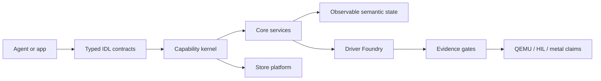

# RamenOS

[](https://github.com/maxwellsantoro/RamenOS/actions/workflows/ci.yml)
[](Cargo.toml)

**Status:** public pre-alpha, active prototype

**Last updated:** 2026-06-24

**Current focus:** hardware evidence loop, then persistent-storage graduation

RamenOS is an evidence-gated Rust OS experiment for agent-native computing.
Instead of making agents and applications drive Unix through screens, files,
shells, and ambient authority, RamenOS is building typed OS interfaces,
explicit capabilities, observable semantic state, and hardware support backed
by reproducible proof.

This repository is not a production OS and does not claim metal graduation,
security readiness, or release readiness without matching evidence. The current
default CI path proves QEMU and Foundry gates; physical hardware claims require
explicit HIL evidence.

## What Works Today

- Boots in QEMU on x86_64 and aarch64.
- Runs IPC ping/pong, negative IPC checks, and trace smoke gates.
- Generates typed IDL bindings and checks wire-contract integrity.
- Runs Store service and POSIX compatibility gates with fail-closed behavior.
- Runs Driver Foundry loops for virtio-net and virtio-blk replay/harness I/O.
- Has hardware-in-the-loop appliance scaffolding, but no broad `PASS/METAL`
  claim yet.

The quickest public proof is the S0 Foundry gate:

```bash
just foundry-s0
```

Expected boot transcript:

```text
RAMEN OS S0 boot
mm: allocator ready
init: hello
init: ping/pong ok
init: ipc badlen small ok
init: ipc badlen large ok
init: ipc unknown proto ok
init: trace ok
```

This proves a QEMU boot path, init startup, typed IPC smoke behavior, and trace
emission. It does not prove production readiness, security readiness, or
physical hardware support.

## Proof Matrix

| Claim | Current evidence | Public command |
| --- | --- | --- |
| QEMU boot works | `PASS/QEMU` S0 boot/IPC/trace gate | `just foundry-s0` |
| IDL contracts are checked | Codegen and wire-contract gates | `just codegen` |
| Store/service fail-closed paths exist | Security and access-policy gates | `just foundry-s7-all-security` |
| Driver Foundry loop exists | virtio-net and virtio-blk replay/harness gates | `just s11`, `just s13` |
| Hardware evidence loop is scaffolded | Appliance inventory/controller contracts | `just s12` |
| Metal readiness | Not claimed as a default public state | Pending opt-in HIL graduation |

See [CURRENT_STATUS.md](CURRENT_STATUS.md) for landed state and
[NEXT_TASKS.md](NEXT_TASKS.md) for the next executable task. Treat
[ROADMAP.md](ROADMAP.md) as background planning, not operational truth.

## Project Shape

RamenOS is developed as vertical slices across three connected pillars:

- **OS Core:** kernel, IPC, capabilities, trace ring, typed harnesses, runtime
  supervisor, and core services.
- **Driver Foundry:** trace capture, replay, scoreboard, distillation, and
  gates for turning observed device behavior into native Rust components.
- **Store Platform:** artifact contracts, launch plans, signature/access
  policy, and the "run now -> vote/port -> publish" path.

The core rules are intentionally narrow:

- Native APIs are typed IDL contracts, not ioctl-style escape hatches.
- Control plane is typed messages; data plane is zero-copy shared memory.
- Fast-path capability validation belongs in the kernel.
- Compatibility is allowed, but it is quarantined and never the native API.
- Claims are gated by evidence levels such as `PASS/QEMU`, `PASS/HIL-LOG`,
  `PASS/HIL-APPLIANCE`, and `PASS/METAL`.



## Where To Start

- To understand the idea: [PLATFORM_OVERVIEW.md](PLATFORM_OVERVIEW.md) and
  [CONSTITUTION.md](CONSTITUTION.md).
- To run something: start with `just foundry-s0`, then
  [docs/GETTING_STARTED.md](docs/GETTING_STARTED.md).
- To contribute or use an agent: [CONTRIBUTING.md](CONTRIBUTING.md) and
  [AGENTS.md](AGENTS.md).

## Quick Start

Install:

- Rust nightly with `rust-src`, `rustfmt`, and `clippy`.
- QEMU and OVMF firmware for target gates.
- `just` for the task aliases.

Common commands:

```bash
just build-host
just codegen
just build-targets
just preflight
```

Useful focused gates:

```bash
just s11
just s12
just s13
just hil-appliance
just foundry-org-governance-g0
```

`just preflight` runs format checking, IDL generation, strict lint tranches,
workspace tests, and the Foundry umbrella gate. CI also runs the extended
Foundry gates and the G0 governance gate.

## Store CLI Examples

Emit a launch plan from the catalog:

```bash
cargo run -p store_cli -- emit-plan \
  --catalog store/catalog.json \
  --program-id ramen.demo.hello \
  --out out/store/launch_plan.json
```

Ingest a file into a local installed store:

```bash
cargo run -p store_cli -- ingest \
  --src /path/to/file \
  --installed-root out/installed
```

Validate an execution launch plan:

```bash
cargo run -p store_cli -- validate-execution-launch-plan \
  --src out/store/launch_plan.json
```

## Hardware And Evidence

Default CI is intentionally hardware-free. It proves inventory, schemas,
negative checks, QEMU behavior, and replay determinism. Physical claims require
explicit environment flags and provenance:

```bash
RAMEN_HIL_APPLIANCE=1 just hil-appliance
RAMEN_HIL_APPLIANCE=1 RAMEN_HIL_GRADUATION=1 just s13-hil
RAMEN_HIL_APPLIANCE=1 RAMEN_HIL_GOLDEN_MACHINE=1 just s12-hil
```

Important boundary: the HIL appliance is lab infrastructure, not target TCB.
The serial observer can produce `PASS/HIL-LOG` from development replay or
`PASS/HIL-APPLIANCE` from live appliance capture. `PASS/METAL` requires the
matching hardware evidence.

## Operational Knobs

Store service:

- `RAMEN_STORE_TRUSTED_KEYS`: trusted Ed25519 key file, required outside dev.
- `RAMEN_STORE_DEV_MODE`: explicit local-dev opt-in for unsigned artifacts.
- `RAMEN_STORE_ACCESS_POLICY`: `AllowAll`, `RequireCredentials`,
  `RequireKnownService`, or `Whitelist`; default is fail-closed.
- `RAMEN_STORE_SOCKET`, `RAMEN_STORE_ROOT`, `RAMEN_STORE_AUDIT_LOG`: local paths.

POSIX runner:

- `RAMEN_POSIX_RUNNER_ACK_RISK=1`: required kill-switch acknowledgment.
- `RAMEN_POSIX_RUNNER_DISABLE_SANDBOX=1`: dangerous local-dev bypass.

HIL:

- `RAMEN_HIL_APPLIANCE=1`: enable physical appliance inventory/control paths.
- `RAMEN_HIL_GRADUATION=1`: require live graduation discipline.
- `RAMEN_HIL_SERIAL_DEV` / `RAMEN_HIL_SERIAL_LOG`: live serial device or
  development log input, depending on the gate.

Development modes are explicit, noisy, and should never be treated as release
configuration.

## Repository Map

- **Target OS:** [kernel/](kernel/), [kernel_uefi/](kernel_uefi/),
  [kernel_aarch64/](kernel_aarch64/), [kernel_api/](kernel_api/).
- **Typed interfaces:** [idl/](idl/), [idl_codegen/](idl_codegen/),
  [schemas/](schemas/).
- **Services and runtime:** [services/](services/),
  [runtime_supervisor/](runtime_supervisor/), [sdk/](sdk/).
- **Driver Foundry:** [driver_foundry/](driver_foundry/),
  [drivers/reference_vaults/](drivers/reference_vaults/), [hardware/](hardware/).
- **Store platform:** [store/](store/), [store_cli/](store_cli/),
  [artifact_store_core/](artifact_store_core/),
  [artifact_store_schema/](artifact_store_schema/).
- **Gates and docs:** [tools/ci/](tools/ci/), [tools/hil/](tools/hil/),
  [docs/](docs/).

## Key Documents

- [CURRENT_STATUS.md](CURRENT_STATUS.md): what has landed.
- [NEXT_TASKS.md](NEXT_TASKS.md): next executable work.
- [PLATFORM_OVERVIEW.md](PLATFORM_OVERVIEW.md): architecture and design model.
- [CONSTITUTION.md](CONSTITUTION.md): project principles.
- [EVIDENCE_LEVELS.md](EVIDENCE_LEVELS.md): claim/evidence vocabulary.
- [SECURITY_STATUS.md](SECURITY_STATUS.md): security posture and boundaries.
- [SLICES.md](SLICES.md): completed slice inventory.
- [STORE_SPEC.md](STORE_SPEC.md): store platform contracts.
- [CONTRIBUTING.md](CONTRIBUTING.md): local preflight and lint policy.
- [AGENTS.md](AGENTS.md): coding-agent operating rules.

## License

RamenOS is licensed under either of:

- [MIT](LICENSE-MIT)
- [Apache-2.0](LICENSE-APACHE)

at your option.
