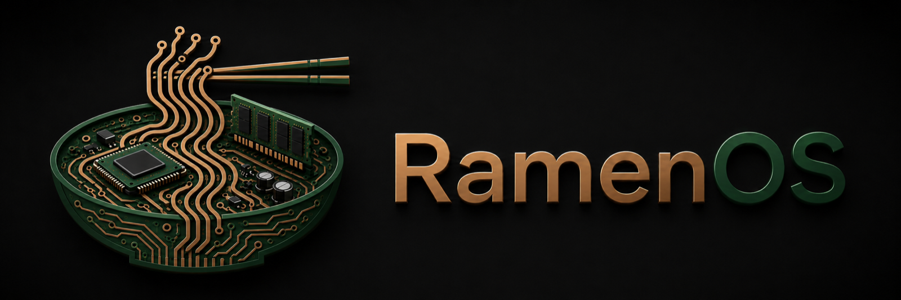
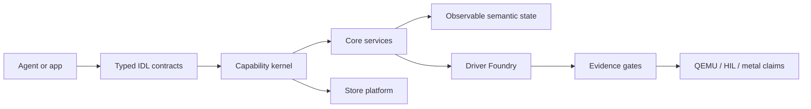

# RamenOS



[](https://github.com/maxwellsantoro/RamenOS/actions/workflows/ci.yml)
[](Cargo.toml)

**Last Updated:** 2026-06-25
**Status:** Public pre-alpha, active development
**Current focus:** hardware evidence loop, then persistent-storage graduation

RamenOS is an evidence-gated OS lab for agent-native computing. Instead of
making agents drive Unix through screens, files, shells, and ambient authority,
RamenOS builds typed OS interfaces, explicit capabilities, and observable
semantic state — backed by reproducible proof.

Founded by [Maxwell Santoro](https://maxwellsantoro.com).

This repository is not a production OS and does not claim metal graduation,
security readiness, or release readiness without matching evidence. The current
default CI path proves QEMU and Foundry gates; physical hardware claims require
explicit HIL evidence.

## The Short Version

RamenOS is trying to prove a narrow, testable idea: agents should interact with
an OS through **typed capabilities** and **observable semantic state**, not by
driving a Unix desktop through shells, pixels, and ambient authority.

The current repo proves the first pieces of that model in QEMU — boot, typed
IPC, trace emission, IDL contract gates, Store/service fail-closed paths, and
Driver Foundry replay loops.

The next public milestone is **live hardware evidence** through the HIL
appliance.

## Why This Exists

The bet: future agents should not be trapped inside a human desktop metaphor.
They should request typed capabilities, observe machine-readable system state,
and run through auditable OS contracts. RamenOS is a small OS lab for proving
that model from boot, IPC, drivers, storage, and eventually UI upward.

Concrete example: instead of giving an agent a root shell and asking it to infer
network or storage state from command output, a RamenOS-style system should let
the agent request a temporary typed capability, receive only the observable
state allowed by that capability, and leave an auditable trail of effects.

## Who This Is For

- OS and Rust systems developers who want a small, evidence-gated kernel and
  services lab.
- Driver and hardware bring-up people interested in trace/replay/oracle loops.
- Agent-infrastructure researchers who care about typed authority,
  machine-readable state, and auditability.
- Curious readers who want a falsifiable pre-alpha project, not a daily-driver
  operating system.

## What Works Today

- Boots in QEMU on x86_64 and aarch64.
- Runs IPC ping/pong, negative IPC checks, and trace smoke gates.
- Generates typed IDL bindings and checks wire-contract integrity.
- Runs Store service and POSIX compatibility gates with fail-closed behavior.
- Runs Driver Foundry loops for virtio-net and virtio-blk replay/harness I/O.
- Has hardware-in-the-loop appliance scaffolding, but no broad `PASS/METAL`
  claim yet.

## Try the Smallest Proof

This does not boot a daily-driver OS. It proves the current public baseline:
QEMU boot, init startup, typed IPC smoke behavior, and trace emission.

```bash
git clone https://github.com/maxwellsantoro/RamenOS.git
cd RamenOS
just foundry-s0
```

Expected boot transcript:

```text
RAMEN OS S0 boot
mm: allocator ready
init: hello
init: ping/pong ok
init: ipc badlen small ok
init: ipc badlen large ok
init: ipc unknown proto ok
init: trace ok
```

This proves a QEMU boot path, init startup, typed IPC smoke behavior, and trace
emission. It does not prove production readiness, security readiness, or
physical hardware support.

## Not Yet

- Not production-ready.
- Not security-ready.
- No broad `PASS/METAL` claim.
- No native desktop or end-user app model yet.
- POSIX compatibility is quarantined, not the native model.

## Proof Matrix

| Claim | Current evidence | Public command |
| --- | --- | --- |
| QEMU boot works | `PASS/QEMU` S0 boot/IPC/trace gate | `just foundry-s0` |
| IDL contracts are checked | Codegen and wire-contract gates | `just codegen` |
| Store/service fail-closed paths exist | Security and access-policy gates | `just foundry-s7-all-security` |
| Driver Foundry loop exists | virtio-net and virtio-blk replay/harness gates | `just s11`, `just s13` |
| Hardware evidence loop is scaffolded | Appliance inventory/controller contracts | `just s12` |
| Metal readiness | Not claimed as a default public state | Pending opt-in HIL graduation |

See [CURRENT_STATUS.md](CURRENT_STATUS.md) for landed state and
[NEXT_TASKS.md](NEXT_TASKS.md) for the next executable task. Treat
[ROADMAP.md](ROADMAP.md) as background planning, not operational truth.

## What Makes It Different

- **Typed native interfaces:** OS services communicate through IDL-defined
  contracts instead of ioctl-like escape hatches or screen-scraped human UI.
- **Capability-backed authority:** Components receive explicit, minimal handles;
  fast-path capability validation belongs in the kernel.
- **Control/data plane split:** Typed messages handle coordination; shared
  memory handles move bulk data.
- **Quarantined compatibility:** POSIX and Linux compatibility are treated as
  compatibility layers, not the native application model.
- **Driver Foundry:** Hardware support is developed through an evidence loop:
  reference vaults, protocol traces, replay scoreboards, minimization, fuzzing,
  and Foundry gates.
- **Research-backed, product-bound:** Research informs the OS where it reduces a
  product or safety risk, with explicit claim boundaries and landing paths.

## Project Shape

The repository is organized around three pillars:

1. **OS Core:** kernel, boot paths, IPC, capabilities, shmem, tracing, services,
   and runtimes.
2. **Driver Foundry:** trace capture, replay, hardware-in-the-loop gates,
   evidence policy, and CI-style validation.
3. **Store Platform:** artifact ingestion, launch plans, native runtime paths,
   compatibility runners, and the early porting ladder.

Development happens through vertical slices. A change should improve boot/run
behavior, implement an IDL contract, add a Foundry gate, or build a Store
feature that consumes an OS capability.



## Where To Start

- To understand the idea: [PLATFORM_OVERVIEW.md](PLATFORM_OVERVIEW.md) and
  [CONSTITUTION.md](CONSTITUTION.md).
- To run something: start with `just foundry-s0`, then
  [docs/GETTING_STARTED.md](docs/GETTING_STARTED.md).
- To contribute or use an agent: [CONTRIBUTING.md](CONTRIBUTING.md) and
  [AGENTS.md](AGENTS.md).

## Quick Start

Requirements:

- Rust toolchain pinned by [rust-toolchain.toml](rust-toolchain.toml).
- `rust-src`, `rustfmt`, and `clippy`.
- QEMU and OVMF firmware for target gates.
- `just` for the task aliases.

Useful commands:

```bash
just build-host
just codegen
just build-targets
just preflight
```

Useful focused gates:

```bash
just s11
just s12
just s13
just hil-appliance
just foundry-org-governance-g0
```

`just preflight` runs format checking, IDL generation, strict lint tranches,
workspace tests, and the Foundry umbrella gate. CI also runs the extended
Foundry gates and the G0 governance gate.

## Hardware And Evidence

Default CI is intentionally hardware-free. It proves inventory, schemas,
negative checks, QEMU behavior, and replay determinism. Physical claims require
explicit environment flags and provenance:

```bash
RAMEN_HIL_APPLIANCE=1 just hil-appliance
RAMEN_HIL_APPLIANCE=1 RAMEN_HIL_GRADUATION=1 just s13-hil
RAMEN_HIL_APPLIANCE=1 RAMEN_HIL_GOLDEN_MACHINE=1 just s12-hil
```

Important boundary: the HIL appliance is lab infrastructure, not target TCB.
The serial observer can produce `PASS/HIL-LOG` from development replay or
`PASS/HIL-APPLIANCE` from live appliance capture. `PASS/METAL` requires the
matching hardware evidence.

See [EVIDENCE_LEVELS.md](EVIDENCE_LEVELS.md) before interpreting hardware
claims.

## Store CLI Examples

Emit a launch plan from the catalog:

```bash
cargo run -p store_cli -- emit-plan \
  --catalog store/catalog.json \
  --program-id ramen.demo.hello \
  --out out/store/launch_plan.json
```

Ingest a file into a local installed store:

```bash
cargo run -p store_cli -- ingest \
  --src /path/to/file \
  --installed-root out/installed
```

Validate an execution launch plan:

```bash
cargo run -p store_cli -- validate-execution-launch-plan \
  --src out/store/launch_plan.json
```

## Operational Knobs

Store service:

- `RAMEN_STORE_TRUSTED_KEYS`: trusted Ed25519 key file, required outside dev.
- `RAMEN_STORE_DEV_MODE`: explicit local-dev opt-in for unsigned artifacts.
- `RAMEN_STORE_ACCESS_POLICY`: `AllowAll`, `RequireCredentials`,
  `RequireKnownService`, or `Whitelist`; default is fail-closed.
- `RAMEN_STORE_SOCKET`, `RAMEN_STORE_ROOT`, `RAMEN_STORE_AUDIT_LOG`: local paths.

POSIX runner:

- `RAMEN_POSIX_RUNNER_ACK_RISK=1`: required kill-switch acknowledgment.
- `RAMEN_POSIX_RUNNER_DISABLE_SANDBOX=1`: dangerous local-dev bypass.

HIL:

- `RAMEN_HIL_APPLIANCE=1`: enable physical appliance inventory/control paths.
- `RAMEN_HIL_GRADUATION=1`: require live graduation discipline.
- `RAMEN_HIL_SERIAL_DEV` / `RAMEN_HIL_SERIAL_LOG`: live serial device or
  development log input, depending on the gate.

Development modes are explicit, noisy, and should never be treated as release
configuration.

## Repository Map

- **Target OS:** [kernel/](kernel/), [kernel_uefi/](kernel_uefi/),
  [kernel_aarch64/](kernel_aarch64/), [kernel_api/](kernel_api/).
- **Typed interfaces:** [idl/](idl/), [idl_codegen/](idl_codegen/),
  [schemas/](schemas/).
- **Services and runtime:** [services/](services/),
  [runtime_supervisor/](runtime_supervisor/), [sdk/](sdk/).
- **Driver Foundry:** [driver_foundry/](driver_foundry/),
  [drivers/reference_vaults/](drivers/reference_vaults/), [hardware/](hardware/).
- **Store platform:** [store/](store/), [store_cli/](store_cli/),
  [artifact_store_core/](artifact_store_core/),
  [artifact_store_schema/](artifact_store_schema/).
- **Gates and docs:** [tools/ci/](tools/ci/), [tools/hil/](tools/hil/),
  [docs/](docs/).

## Governance and Research

This repository also hosts the **RamenOrg** governance scaffolding and the
research program. Both are kept strictly parallel to the OS execution track and
grant no merge, release, hardware, or public-support authority on their own.

- Governance artifacts, the authority ladder, and the merge gate: [docs/org/](docs/org/).
- Research program and open questions: [docs/research/](docs/research/).

## Contributing

RamenOS favors small, evidence-bearing slices over large subsystem drops.

### Useful help right now

- **Serious systems help:** the S12.4 HIL appliance loop — serial observation,
  power/reset actuation, and the claim boundaries around HIL appliance evidence.
- **Newcomer help:** run `just foundry-s0` on your machine and report any
  host/QEMU/OVMF boot issues you hit.
- **Docs help:** tighten setup notes for macOS/Linux hardware combinations, and
  flag anywhere the docs lose a new reader.

Before proposing a change:

- Read [CONTRIBUTING.md](CONTRIBUTING.md).
- Read [AGENTS.md](AGENTS.md) if you are working with an AI coding agent.
- Add new native interfaces under [idl/](idl/) and regenerate bindings.
- Keep kernel, services, and Store boundaries separate.
- Run `just preflight` before pushing when practical.

For driver work, start from the Reference Vault and protocol traces. The goal is
to produce code whose observed behavior matches the Oracle, then gate it.

## Key Documents

- [CURRENT_STATUS.md](CURRENT_STATUS.md): what has landed.
- [NEXT_TASKS.md](NEXT_TASKS.md): next executable work.
- [PLATFORM_OVERVIEW.md](PLATFORM_OVERVIEW.md): architecture and design model.
- [CONSTITUTION.md](CONSTITUTION.md): project principles.
- [EVIDENCE_LEVELS.md](EVIDENCE_LEVELS.md): claim/evidence vocabulary.
- [SECURITY_STATUS.md](SECURITY_STATUS.md): security posture and boundaries.
- [SECURITY.md](SECURITY.md): how to report a vulnerability.
- [CODE_OF_CONDUCT.md](CODE_OF_CONDUCT.md): community standards.
- [SLICES.md](SLICES.md): completed slice inventory.
- [STORE_SPEC.md](STORE_SPEC.md): store platform contracts.
- [CONTRIBUTING.md](CONTRIBUTING.md): local preflight and lint policy.
- [docs/INDEX.md](docs/INDEX.md): documentation index.
- [AGENTS.md](AGENTS.md): coding-agent operating rules.

## License

RamenOS is licensed under either of:

- [MIT](LICENSE-MIT)
- [Apache-2.0](LICENSE-APACHE)

at your option.
