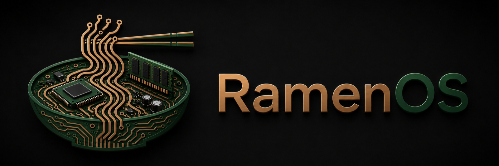

# RamenOS



[](https://github.com/maxwellsantoro/RamenOS/actions/workflows/ci.yml)
[](Cargo.toml)

**Last Updated:** 2026-09-16
**Status:** Public pre-alpha, active development

RamenOS is an experimental Rust OS for agents. Its native interface is built
around **typed, revocable capabilities** and **machine-readable system state**:
an agent should be able to discover what it may observe, request limited
authority, and accomplish a task through explicit OS contracts.

The question is whether this model makes useful agent work easier to complete,
more narrowly authorized, and easier to audit than working through shells and
screens. The repository implements substantial parts of that model; a complete
agent-task comparison is still to be built.

Founded by [Maxwell Santoro](https://maxwellsantoro.com).

## The task we want to demonstrate

> Repair one workspace's configuration, run its validator, and return the
> validated artifact. Access to another workspace must remain denied even if
> retrieved content tells the agent to use it.

| Step | Conventional shell/tool workflow | Planned RamenOS workflow |
|------|----------------------------------|--------------------------|
| Inspect | Read files and interpret command output | Receive task-scoped semantic state and typed query results |
| Obtain authority | Configure process credentials and sandbox permissions | Request grants for specific resources and operations |
| Repair and validate | Edit a file and invoke a validator | Commit a new artifact and launch a pinned validator through typed contracts |
| Attempt forbidden access | Depend on the configured OS sandbox | Reject the operation at the capability enforcement boundary |
| Report | Correlate outputs, exit status, and logs | Return content IDs, validation state, and a replayable record of requests and effects |

This is the **planned [Agent Task Proof](docs/plans/2026-09-16-agent-task-proof.md)**,
not a transcript of a working demo. Its primary comparison uses a scoped Linux
baseline with equivalent task resources. It will measure completion, tool calls,
context cost, effective authority, denied operations, recovery, and audit/replay
coverage. Linux can enforce narrow permissions too; the experiment must establish
what RamenOS adds. No comparative advantage is claimed yet.

## What is real today

| Component | Landed behavior | Execution boundary |
|-----------|-----------------|--------------------|
| Kernel | x86_64 and aarch64 boot; typed IPC; capabilities; shared memory; tracing | QEMU target paths; capability-table operations reject use after the SMP transition |
| Typed contracts | IDL/codegen and wire checks for Harnesses and Portals | Shared kernel/runtime types; no native ioctl escape hatch |
| Native WASM runner | Wasmtime execution, granted-handle injection, missing-capability rejection | Host runtime, not Wasmtime running on the target |
| Semantic State | Snapshot contracts, subscriptions, capability-filtered host views | Host reactor plus selected QEMU snapshot/IPC bridges; default snapshot metadata still contains placeholders |
| Store and projections | Artifact ingestion, ownership checks, queries, copy-on-write foundations | Host services; complete task-scoped mutation/launch integration remains work |
| Execution fabric | Placement and launch-plan contracts | Simulation-only routing/load; no distributed transport claim |
| Driver Foundry | virtio-net and virtio-blk Oracle/replay loops and runtime harness I/O | Host tooling and QEMU device paths |
| Hardware loop | Golden-machine contract, appliance inventory and serial-capture tooling | First live Pi↔M900 capture and physical graduation remain pending |

The [integration inventory](docs/plans/2026-06-17-s10-5-host-to-target-integration.md)
explains the host/target split. The kernel's capability checks and the host
services' policies are real components; they are not yet one complete
target-native agent environment.

## Run the existing components

Install the pinned Rust toolchain, `just`, QEMU, and OVMF using
[Getting Started](docs/GETTING_STARTED.md), then:

```bash
git clone https://github.com/maxwellsantoro/RamenOS.git
cd RamenOS

# Host: snapshots, subscriptions, filtered views, and runner integration tests
just foundry-semantic-state-s10-2

# Target: dual-architecture QEMU boot, IPC, and tracing
just foundry-s0
```

The first command exercises host component behavior; the second proves the boot
and IPC baseline. Neither runs an autonomous agent or the planned task proof.

| Evidence to inspect | Command |
|---------------------|---------|
| Canonical protocol IDs and direct IPC wire types | `just idl-lint` |
| Host broker and semantic/shmem proxy | `just foundry-broker-kernel-bridge-s10-5-1` |
| Selected host-to-QEMU IPC paths | `just foundry-qemu-ipc-bridge-s10-5-2` |
| Driver replay and runtime net/block I/O | `just s11`, `just s13` |
| Golden-machine, GOP, and appliance scaffolds | `just s12` |

Foundry is how claims are checked: host tests, QEMU, replay, live HIL, and metal
observations have different meanings. Default CI is hardware-free.
[`PASS/QEMU` does not imply `PASS/METAL`](EVIDENCE_LEVELS.md).

## What comes next

The physical execution track remains **S12.4 live serial capture → AMT
power/reset → S12 on SATA → S13 NVMe graduation**. The Agent Task Proof adds a
bounded software integration priority before S14 USB/HID and desktop expansion:
a deterministic task gate first, then an opt-in model comparison, then explicit
target enforcement evidence.

[Current Status](CURRENT_STATUS.md) records landed work and
[Next Tasks](NEXT_TASKS.md) owns execution order.
[Roadmap](ROADMAP.md) describes longer-range direction.

RamenOS is useful today as an experimental systems platform for typed OS
interfaces, agent authority, semantic observability, and driver evidence. It is
not a daily-driver OS, production security substrate, or Linux replacement.
POSIX remains a compatibility layer. See [Security Status](SECURITY_STATUS.md)
for implementation limits and open risks.

## Explore and contribute

- **Understand the design:** [Platform Overview](PLATFORM_OVERVIEW.md) and
  [Constitution](CONSTITUTION.md), including request authority versus observable
  authority.
- **Run or debug components:** [Getting Started](docs/GETTING_STARTED.md) and
  [Development Reference](docs/DEVELOPMENT_REFERENCE.md) for Store examples,
  operator settings, and the repository map.
- **Help demonstrate the thesis:** [Agent Task Proof plan](docs/plans/2026-09-16-agent-task-proof.md).
- **Help with hardware:** [Next Tasks](NEXT_TASKS.md) and
  [Evidence Levels](EVIDENCE_LEVELS.md); start driver work from Reference Vaults
  and protocol traces.
- **Contribute a slice:** [Contributing](CONTRIBUTING.md), [Agent Instructions](AGENTS.md),
  and [Slices](SLICES.md). Each slice needs a consumer, a bounded contract, and
  a deterministic Foundry gate.
- **Find other docs:** [Documentation Index](docs/INDEX.md), including the
  subordinate RamenOrg governance and research tracks. Those artifacts grant no
  merge, release, hardware, or public-support authority on their own.

Please follow the [Code of Conduct](CODE_OF_CONDUCT.md). Report vulnerabilities
through [Security](SECURITY.md).

## License

RamenOS is licensed under either [MIT](LICENSE-MIT) or
[Apache-2.0](LICENSE-APACHE), at your option.
