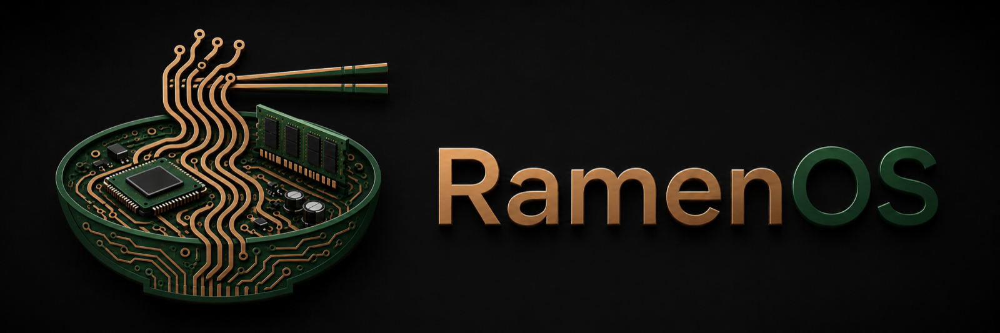

# RamenOS



[](https://github.com/maxwellsantoro/RamenOS/actions/workflows/ci.yml)
[](Cargo.toml)

**Last Updated:** 2026-10-03
**Status:** Public pre-alpha, active development

RamenOS is a modern, post-Unix operating system being built for **humans and AI
agents** to use efficiently and safely. Its goal is an everyday OS that combines
fast execution, hardware adaptability, approachable human interactions, and
structured interfaces for agents.

The design separates kernel mechanisms, services, and software distribution.
Drivers and software are intended to evolve independently behind **typed
contracts**, with isolated execution, explicit permissions, and Foundry evidence
to check failures and effects across boundaries. Useful compatibility stays,
while native interfaces can evolve beyond inherited Unix constraints.

Humans remain in control of intent and policy. Agents should discover permitted
state and act through **scoped, revocable capabilities**, without requiring
screen scraping or fragile command-output parsing for core control. OS Core,
Foundry, and the Store are the three pillars supporting this product.

Read the [Vision](VISION.md) for the destination. The project is public pre-alpha:
substantial kernel and host components exist, while the integrated desktop,
target runtime, and broader hardware qualification remain work. The Agent Task
Proof below tests one part of the vision; comparative agent benefits remain
unproved.

Founded by [Maxwell Santoro](https://maxwellsantoro.com).

## One step toward the vision: the Agent Task Proof

> Repair one workspace's configuration, run its validator, and return the
> validated artifact. Access to another workspace must remain denied even if
> retrieved content tells the agent to use it.

| Step | Conventional shell/tool workflow | Planned shared typed workflow (Linux and RamenOS) |
|------|----------------------------------|--------------------------|
| Inspect | Read files and interpret command output | Receive task-scoped semantic state and typed query results |
| Obtain authority | Configure process credentials and sandbox permissions | Request grants for specific resources and operations |
| Repair and validate | Edit a file and invoke a validator | Stage an immutable candidate, run its pinned validator, then commit the validated artifact |
| Attempt forbidden access | Enforce the configured OS sandbox | Enforce the named backend boundary; test it independently of the adapter |
| Report | Correlate outputs, exit status, and logs | Return content IDs, validation state, and a replayable record of requests and effects |

This is the **planned [Agent Task Proof](docs/plans/2026-09-16-agent-task-proof.md)**,
not a transcript of a working demo. It uses three arms with equivalent task
resources: **Linux scoped shell, Linux typed, and RamenOS typed**. The typed arms
share the agent-visible protocol wherever possible:

- Linux typed vs Linux shell measures the value of structured interaction.
- RamenOS typed vs Linux typed tests what the implemented substrate adds.
- RamenOS typed vs Linux shell measures the complete task-level proposition.

One hidden fixture bank and evaluator check completion, normalized effective
authority, forbidden backend probes, context/tool cost, recovery, and audit/replay.
Success, authority, and cost claims are reported separately. Linux can enforce
narrow permissions too; no comparative advantage is claimed yet.

## What is real today

| Component | Landed behavior | Execution boundary |
|-----------|-----------------|--------------------|
| Kernel | x86_64 and aarch64 boot; typed IPC; capabilities; shared memory; tracing | QEMU target paths; single-threaded capability-table prototype; SMP use is deliberately blocked |
| Typed contracts | IDL/codegen and wire checks for Harnesses and Portals | Native interfaces are IDL-defined; project policy forbids ioctl-style escape hatches |
| Native WASM runner | Wasmtime execution, granted-handle injection, missing-capability rejection | Host runtime, not Wasmtime running on the target |
| Semantic State | Snapshot contracts, subscriptions, capability-filtered host views | Host reactor plus selected QEMU snapshot/IPC bridges; default snapshot metadata still contains placeholders |
| Store and projections | Artifact ingestion, ownership checks, queries, copy-on-write foundations | Host services; complete task-scoped mutation/launch integration remains work |
| Execution fabric | Placement and launch-plan contracts | Simulation-only routing/load; no distributed transport claim |
| Driver Foundry | virtio-net and virtio-blk Oracle/replay loops and harness vector transfers | Host replay, Linux Oracle devices, and QEMU harness fixtures |
| Hardware loop | Golden-machine contract, appliance inventory and serial-capture tooling | First live Pi↔M900 capture and physical graduation remain pending |

The [integration inventory](docs/plans/2026-06-17-s10-5-host-to-target-integration.md)
explains the host/target split. The kernel's capability checks and the host
services' policies are real components; they are not yet one complete
target-native agent environment.

## Run the existing components

Install the pinned Rust toolchain, `just`, QEMU, and OVMF using
[Getting Started](docs/GETTING_STARTED.md), then:

```bash
git clone https://github.com/maxwellsantoro/RamenOS.git
cd RamenOS

# Host: snapshots, subscriptions, filtered views, and runner integration tests
just foundry-semantic-state-s10-2

# Target: dual-architecture QEMU boot, IPC, and tracing
just foundry-s0
```

The first command exercises host component behavior; the second proves the boot
and IPC baseline. Neither runs an autonomous agent or the planned task proof.

| Evidence to inspect | Command |
|---------------------|---------|
| Canonical protocol IDs and direct IPC wire types | `just idl-lint` |
| Host broker and semantic/shmem proxy | `just foundry-broker-kernel-bridge-s10-5-1` |
| Selected host-to-QEMU IPC paths | `just foundry-qemu-ipc-bridge-s10-5-2` |
| Driver replay and net/block harness vector transfers | `just s11`, `just s13` |
| Golden-machine, GOP, and appliance scaffolds | `just s12` |

Foundry is how claims are checked: host tests, QEMU, replay, live HIL, and metal
observations have different meanings. Default CI is hardware-free.
[`PASS/QEMU` does not imply `PASS/METAL`](EVIDENCE_LEVELS.md).

Full `just preflight` mirrors CI's complete SW0 sequence. It requires a Linux
host, Python `jsonschema`, a Docker engine with its builtin seccomp profile, and
the pinned image from `tools/agent_task/linux_sandbox.py` already installed.
Missing prerequisites produce `INCOMPLETE` before the build; individual host/QEMU
gates remain useful on macOS. S11.8/S13.6 validate embedded-vector harness
transfers and do not establish device-backed native net/block I/O.

## What comes next

The physical lane H0–H3 is **S12.4 live serial capture → AMT power/reset → S12
on SATA → S13 NVMe boot and verified reboot/rollback**, awaiting test-hardware
setup. SW0's A0/A1 host task and A2 Linux controls through A2.9 finite requestable
authority are implemented. Next are the remaining host/deputy/unexercised and
continuous-authority controls in [Next Tasks](NEXT_TASKS.md), followed by a bounded
opt-in comparison and explicit target enforcement evidence. It does not wait for
hardware graduation. S14 requires the stable H0/H1 appliance loop, reviewed
A1/A2 evidence and a recorded decision on the bounded comparison report, plus
its own design/IDL/Oracle/gate plan.

[Current Status](CURRENT_STATUS.md) records landed work and
[Next Tasks](NEXT_TASKS.md) owns execution order.
[Roadmap](ROADMAP.md) describes longer-range direction.

Today's pre-alpha supports development and evaluation of typed OS interfaces,
agent authority, semantic observability, and driver evidence. Everyday use is
the destination; a complete desktop and production security assurance still
require implementation and validation. POSIX remains a compatibility layer.
See [Security Status](SECURITY_STATUS.md) for implementation limits and open risks.

## Explore and contribute

- **Understand the design:** [Platform Overview](PLATFORM_OVERVIEW.md) and
  [Constitution](CONSTITUTION.md), guided by the [Vision](VISION.md), including
  human control and request authority versus observable authority.
- **Run or debug components:** [Getting Started](docs/GETTING_STARTED.md) and
  [Development Reference](docs/DEVELOPMENT_REFERENCE.md) for Store examples,
  operator settings, and the repository map.
- **Help demonstrate the thesis:** [Agent Task Proof plan](docs/plans/2026-09-16-agent-task-proof.md).
- **Help with hardware:** [Next Tasks](NEXT_TASKS.md) and
  [Evidence Levels](EVIDENCE_LEVELS.md); start driver work from Reference Vaults
  and protocol traces.
- **Contribute a slice:** [Contributing](CONTRIBUTING.md), [Agent Instructions](AGENTS.md),
  and [Slices](SLICES.md). Each slice needs a consumer, a bounded contract, and
  a deterministic Foundry gate.
- **Find other docs:** [Documentation Index](docs/INDEX.md), including the
  subordinate RamenOrg governance and research tracks. Those artifacts grant no
  merge, release, hardware, or public-support authority on their own.

Please follow the [Code of Conduct](CODE_OF_CONDUCT.md). Report vulnerabilities
through [Security](SECURITY.md).

## License

RamenOS is licensed under either [MIT](LICENSE-MIT) or
[Apache-2.0](LICENSE-APACHE), at your option.
