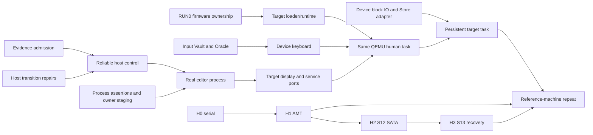

# Roadmap

**Last Updated:** 2026-10-08
**Status:** Product checkpoints and dependencies; no completion-date or readiness claim

[Vision](VISION.md) owns the destination: an everyday post-Unix OS for humans and
AI agents. [Current Status](CURRENT_STATUS.md) owns landed behavior and limits;
[Next Tasks](NEXT_TASKS.md) owns the ready frontier and exact acceptance. Slice
definitions live in [SLICES.md](SLICES.md), history in [Changelog](CHANGELOG.md),
and rationale in [Decisions](DECISIONS.md).

## Shortest path to a useful, dependable computer

Keep one keyboard-first human task unchanged across stronger boundaries: launch
through a permission preview, read/edit/save an artifact and recover after failure.
Core interaction must work without a model. The default-off trusted in-process
host consumer is implemented; current review findings require reliability repairs
before it becomes the foundation for process integration. Target persistence needs
actual storage IO/readback, not a host journal or embedded vector.

| Checkpoint | Concrete completion | Dependencies / claim |
|------------|---------------------|----------------------|
| Reliable host control | Repair pending reply ownership, render cancellation/focus and pre-admission Save state; resolve the journal staging investigation and CI evidence gaps | Keep original task/denial/recovery controls and add transition regressions. Host fixture only. |
| Real application process | Existing editor core runs in an actual Linux child through authenticated typed channels, immutable publications and retained original Save owners | Reviewed full process assertions and ownership-safe lifecycle; preserve in-process control. Host process evidence does not prove target or general containment. |
| Same task on RamenOS/QEMU | Actual target loader/runtime, input, compositor/display and named required services execute the task with grants, denial and crash/restart | Join runtime+input+display branches; name any host services. Saving across restart additionally joins device-backed storage. |
| Persistent target task | Actual block read/write/flush and Store IO produce verified save/reopen and failure recovery | Concrete device profile and durability/ordering assertions; vector or firmware-detection success is insufficient. |
| Qualified reference machine | Repeat the task with live provenance, required input/display/storage qualification and reboot/readback/recovery | H0→H1 observation/actuation; relevant S12/S13 and controller evidence. One machine, no broad everyday-readiness claim. |

Use one application, one input controller and a basic display path. Accelerated
GPU, pointer input, more apps, distributed transport and a generic deployment
resolver follow demonstrated needs. Do not turn the first checkpoint into a
platform-wide rewrite or wait for unrelated studies/hardware runs.

## Parallel execution with explicit joins

Use one coordinator, two implementers and one independent reviewer by default.
The coordinator freezes shared contracts/assertions, assigns disjoint files and
resources, integrates one reviewed packet at a time and owns final validation.
A successor starts when its own prerequisites clear; unrelated packets need not
finish together. Reserve review capacity rather than accumulating completed
patches. [Agentic Workflow](docs/AGENTIC_WORKFLOW.md) owns the mechanics.

RUN0 memory ownership, input Vault/Oracle preparation and device-backed storage
can advance while host repairs/process work proceed. A worker needs the selected
device's Reference Vault and Oracle protocol_trace before device implementation.
Do not require physical H0–H3 for host/QEMU work or SW0. Physical execution keeps
its own explicit authorization and prerequisites. Target compositor/service ports
can prepare against frozen host contracts before process completion; their final
acceptance joins the real target task.

Split process work at assertions/owner staging, authenticated carrier, child
edit/raster and Save/recovery integration. After interface freeze, carrier and
child implementation can overlap in separately assigned files; acceptance requires
real combined execution. When two repairs touch the same host or Store lifecycle,
serialize that scope and backfill with independent work. Exact ready packets and
regression obligations live only in [Next Tasks](NEXT_TASKS.md#ready-work-front).

## Demonstrate independent evolution

The combined OS Core/Foundry/Store proposition is to reduce the cost of safe change:
versioned contracts bound behavior, authority, resources and recovery; Foundry
qualifies actual implementations; Store helps discover, authorize and activate
suitable artifacts. Fault containment and compatibility remain properties to
measure, not consequences inferred from modular code or typed messages.

After the genuine process task, run one bounded component-replacement experiment
alongside target preparation. Keep its consumer unchanged; qualify a second
implementation, activate it, inject failure and recover while an unrelated human
task progresses. Define logical identity, implementation generation, unresolved
operations, state compatibility and permitted service interruption first.
Boot-time activation or bounded service interruption is acceptable when that is
the evidenced recovery mode; uninterrupted hot swapping is not a universal promise.

Measure changes outside the component, implementation/qualification effort, reused
versus fresh evidence, resource cost, disruption and recovery success. Hardware
variants must additionally establish actual DMA mappings, reset scope and buffer
retirement before memory reuse. A driver process crash alone cannot establish a
hardware failure boundary. Use device dossiers and existing contracts rather than
opening a new generic framework before a real consumer needs it.

## Keep independent lanes bounded

| Lane | Useful work now | Acceptance boundary |
|------|-----------------|---------------------|
| SW0 Agent Task Proof | Remaining named authority/lifetime and offline provider-supervision controls | Complete deterministic A2 plus independently frozen bank/study releases before opt-in funded model collection. Host evidence is not target enforcement. |
| Recovery / S13 | Slot publication/readback, revisioned selection and interrupted-phase verifier | Fresh new-slot and rollback boots with provenance for physical graduation; metadata scaffold is insufficient. |
| H0–H3 | Lab setup, serial observer, AMT, SATA and NVMe qualification in order | Software preparation proceeds independently; physical acts require explicit authority and per-device evidence. |
| G0 Org Kernel / Research Office | Concrete research/coordination inputs that unblock a named packet | G0.8.1 A2-local boundaries remain; no autonomous approval, merge, release, spending or hardware authority. |

The agent study tests one part of the product. Preserve interface/substrate/total
contrasts, unknown authority, failures in the denominator and predeclared funded
ceilings. A tie, regression or exploratory report is valid; no positive study is
a prerequisite for human interaction. See [the study plan](docs/plans/2026-09-16-agent-task-proof.md).

## Fast feedback, complete acceptance

Choose validation before implementation: pure contracts/tooling first, focused
feature-correct developer checks during edits, affected producer/consumer gates at
handoff, and canonical CI lanes on a fixed assembled candidate. Reserve shared
outputs and compiler targets. Reuse compilation, not PASS results; unchanged-input
focused evidence may be referenced only for its original scope. Do not duplicate
complete preflight locally after the equivalent complete lanes passed on the same
candidate. Host/QEMU/physical claims retain their separate evidence requirements.

CI currently has four isolated execution lanes and one complete canonical stage
inventory. Measure actual stage/setup/cache/queue costs before splitting gates,
batching feature graphs or adding runner complexity. Preserve every behavior,
denial and failure assertion, fresh evidence and fail-closed aggregate. Smaller
reviewed PRs and fewer repeated builds improve throughput without widening real
timeouts or using retries to hide failures. [The execution profile](docs/FOUNDRY_CI_OPTIMIZATION_V0.md)
owns commands and measurements.

## Expansion after the checkpoint

Useful software, compatibility-to-native ports, live Semantic State, broader
hardware, native networking and sustained usability/reliability extend the product.
Execution-fabric transport, generalized wizard/deployment orchestration and new
research interfaces need a bounded consumer and evidence plan. Admit them when
they unblock the next task or address a measured risk. Everyday readiness requires
broader useful workloads and sustained evidence; completing a host/QEMU checkpoint
does not establish it. No delivery date or development-speed advantage is claimed.
