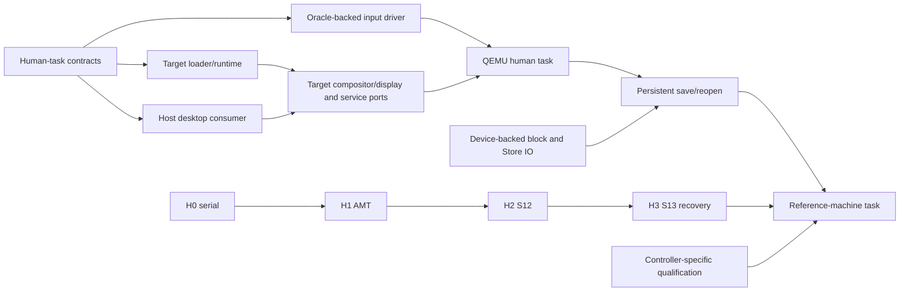

# Roadmap

**Last Updated:** 2026-10-04
**Status:** Directional; dependencies qualify work and claims, not readiness

[VISION.md](VISION.md) defines the destination: an everyday, post-Unix OS for
humans and AI agents. [CURRENT_STATUS.md](CURRENT_STATUS.md) owns landed behavior
and evidence; [NEXT_TASKS.md](NEXT_TASKS.md) owns ready work and acceptance.
Milestone history belongs in [CHANGELOG.md](CHANGELOG.md), slice definitions in
[SLICES.md](SLICES.md), and sequencing decisions in [DECISIONS.md](DECISIONS.md).

## Deliver the first integrated human task

The next product checkpoint is a small desktop task: boot, use a keyboard to
launch one application through a permission preview, edit and commit a local
artifact, then recover the application after an injected failure. Saving across
restart additionally requires actual persistent storage and readback evidence.
The task must work without a model. Define its exact scenario and pass/fail
criteria before implementing new interfaces; this is a proposed checkpoint,
not a description of today's system.

Deliver it in three evidence stages:

| Checkpoint | Required result | Claim boundary |
|------------|-----------------|----------------|
| Host integration | Typed input/surface/focus contracts connect an application, permission/launch flow and recovery consumer; denial and failure gates pass | Host interaction and contracts; replayed input is not a USB driver or target desktop |
| QEMU integration | A target loader/runtime runs the named consumer; device-backed input reaches it and rendered output, grants and restart behavior are checked | Only components actually executing on target qualify; any host service remains named |
| Reference-machine integration | Qualified input/display/storage paths reproduce the task with live provenance and reboot/readback/recovery evidence | One qualified machine and task; no broad hardware or everyday-readiness claim |

Prefer one keyboard-first application, one display path and one device profile.
Pointer input, more applications and compatibility surfaces follow the first
working task. A basic framebuffer path may be chosen by the design; accelerated
GPU support, broad driver coverage and distributed execution need not precede
this checkpoint. The target loader, service boundary and native device I/O are
real unfinished work, not capabilities supplied by the existing QEMU bridge.

## Dependency-driven parallel work

A coordinator dispatches bounded, independently reviewable packets to workers,
owns shared-contract changes and integrates each result with its consumer. Start
with up to three workers; add capacity only when edit scopes, build resources and
interfaces remain independent. Prefer finishing the current product path over
opening more foundations. The ready frontier and packet scopes live only in
[Next Tasks](NEXT_TASKS.md#ready-work-front); collaboration mechanics live in
[Agentic Workflow](docs/AGENTIC_WORKFLOW.md).

| Lane | Work that can start independently | Actual join point |
|------|----------------------------------|-------------------|
| Human interaction / S14–S15 | Human-task design, typed input/surface/focus contracts, host consumers and gate definitions | Target task joins its loader/runtime, implemented input and display paths, grants and recovery |
| Target runtime and services | Smallest loader/runtime consumer and explicit host/target split, after its contract/gate is fixed | Target execution claims require actual execution and enforcement; persistence joins the storage path |
| Drivers and storage | Reference Vault/Oracle preparation, device-backed QEMU I/O, slot publication/readback and fault/recovery protocol | Driver implementation needs its own evidence; physical runs need prepared devices and live provenance |
| SW0 Agent Task Proof | Remaining authority controls and offline evaluator controls in separate scopes | Complete deterministic A2 conformance and frozen study controls precede model collection |
| H0–H3 physical work | Lab preparation; software verifier work proceeds without lab access | H0 serial observation → H1 AMT actuation → H2 S12 SATA → H3 S13 NVMe/update/rollback |
| G0 Org Kernel / Research Office | Bounded planning, evidence review and research needed by a concrete packet | No authority expansion; research must have a consumer and landing path |

SW0 runs alongside this graph. Device branches retain their own Vault/Oracle,
IDL and gate prerequisites; the graph shows integration joins, not permission
to skip them. Target display/service ports are implementation work with their
own gates before the QEMU task can pass.

S14/S15 design, contracts, replay, host and QEMU work do **not** wait for SW0
Phase B, a positive agent comparison, or H0–H3 graduation. H0/H1 remain
prerequisites for physical S14 integration; device-specific Reference Vaults,
Oracle `protocol_trace`, IDL and denial/failure gates remain prerequisites for
the corresponding driver work. H2/H3 constrain their physical qualification
claims, not unrelated software development. SW0 Phase C can add named target
enforcement when those target contracts exist, without waiting for Phase B.

The coordinator integrates after every bounded packet, runs affected producer
and consumer gates against the combined revision, and updates landed state only
from that evidence. Shared IDL, generated code, registry, kernel initialization
and build/gate entry points have one active owner at a time. A worker blocked on
hardware, credentials or a contract returns its evidence and yields capacity to
ready work. Parallel branches do not bypass independent review or merge policy.

## Human input and desktop scope

**S14** establishes reliable keyboard input, then pointer input, on one reference
xHCI controller. Its own design selects the bounded USB/HID control contract,
shared-memory data path, Oracle/replay evidence and failure behavior. Host input
injection can develop the consumer while the device path is built; only actual
device execution qualifies driver claims.

**S15** connects a native compositor, typed input/focus and application surfaces,
permission previews, launch and recovery. Contracts and host consumers can
advance before S14 device completion. Target integration joins S14 with an
actual target runtime and the required services; compatibility surface export is
a later consumer of the same native boundary. Frame delivery, unauthorized focus
or input, stale surfaces, failed applications and service recovery need gates.
Human usability and responsiveness also need measured task checks beyond those
component assertions.

## Agent evidence remains an independent product input

The [Agent Task Proof](docs/plans/2026-09-16-agent-task-proof.md) compares Linux
scoped shell, Linux typed and RamenOS typed on a scoped configuration repair.
Preserve interface/substrate/total contrasts, unknown authority, forced backend
denials, independent hidden partitions and frozen bank/study/provider controls.
Complete A2 before model collection. The opt-in, funded pilot determines whether
an affordable powered comparison fits the predeclared ceiling; otherwise report
exploratory evidence with uncertainty. A tie or regression is a valid result.

Review the report to choose the next agent-facing improvement or cap further
study. It evaluates one agent task and does not gate unrelated human interaction
or prove the whole OS. Target enforcement remains a separate, per-operation
evidence path; host comparisons cannot establish a target-kernel advantage.

## Physical qualification and durable recovery

Physical runs await setup. S13 graduation requires implemented inactive-slot
publication/readback, revisioned boot selection, a new-slot boot and a separate
rollback/recovery boot with fresh provenance. Develop its software verifier and
failure assertions while the hardware is unavailable. The current metadata
scaffold cannot supply that evidence.

Firmware NVMe boot and embedded Oracle-vector transfers do not establish native
device-backed I/O. QEMU block read/write/flush and native NVMe on the selected
controller need their own consumers and qualification. See the
[S13 design](docs/plans/2026-06-21-s13-persistent-storage-design.md) and
[Evidence Levels](EVIDENCE_LEVELS.md).

## Expand from the integrated checkpoint

| Follow-up | Evidence needed before widening the claim |
|-----------|--------------------------------------------|
| Useful software and Store | More human tasks, permission/launch/recovery flows, controlled compatibility scratch-to-commit and observed-capability manifests |
| Live Semantic State and agents | Real source aggregation/reactor, named target grants and operation enforcement, measured observation contracts |
| Hardware breadth and native networking | Actual device-backed transfers, Oracle comparisons, DMA boundaries and per-profile qualification |
| Performance and modularity | Representative latency/resource measurements plus replacement, recovery and availability checks with affected consumers |
| Execution fabric and porting orchestration | Real transport/failure/resource-authority contract or concrete wizard consumer, each with its own gate |

These are follow-up outcomes, not prerequisites for every earlier packet. The
first integrated checkpoint is complete only when its declared tasks, failures,
denials and evidence stages pass. Everyday readiness additionally needs useful
software, broader hardware, sustained reliability and human validation; a green
host or QEMU gate cannot close those requirements. Do not assign completion
dates or claim faster agent development without measured throughput evidence.

## Research and deferred decisions

The **G0 Org Kernel** and **Research Office** prepare bounded inputs without
granting merge, release, hardware or public-support authority. RQ-0001 studies
offer-shaped service boundaries and observation limits; RQ-0002 studies
capability-governed project operation. See [Research](docs/research/INDEX.md).
Request authority (`Lang`) and observable authority (`ObsContract`) stay distinct.

Semantic vector/graph search, S5.1 wizard orchestration, real execution-fabric
transport, broad broker migration, V-10 supervisor policy ownership, V-13 object
lifetime/transaction fixes, offer-shaped runtime interfaces and authority above
A2-local each need a bounded design and evidence plan. Admit them when they
unblock a named product task or address an evidenced risk; do not make the first
desktop contingent on completing every research program.
