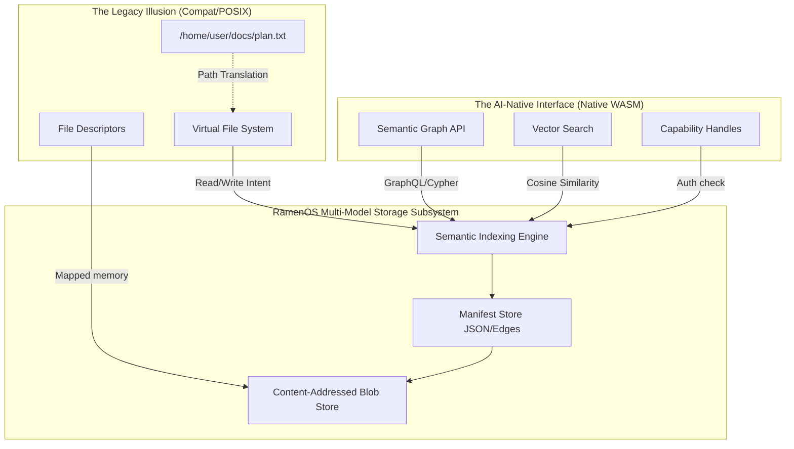

# S10.3: Multi-Model Projection Storage Design

**Last Updated:** 2026-06-17
**Status:** Complete for phases S10.3.0–S10.3.4
**Related:** PLATFORM_OVERVIEW.md, CONSTITUTION.md, STORE_SPEC.md, `docs/archive/plans/2026-06-17-s10-3-1-projection-index-backend.md`

---

## Executive Summary

This document defines the architecture for **Projection Storage**, a hybrid storage subsystem that bridges the gap between legacy POSIX file-path expectations and the AI-native requirement for a structured, semantic vector graph. 

The core storage remains a **Content-Addressed Store (CAS)** of immutable blobs. We then project different "masks" (VFS for POSIX, Graph API for AI) over this base layer.

**Key Design Decisions:**
- **CAS as Single Source of Truth:** All data is stored as immutable sha256 blobs.
- **VFS as a Dynamic Projection:** The `/home/user/docs` hierarchy is a virtual view generated on-the-fly from metadata tags.
- **Copy-on-Write Ingestion:** POSIX "writes" are intercepted, buffered, and ingested as new immutable blobs with updated semantic indices.
- **Semantic Indexing Engine:** Maps tags, aliases, and path projections to blob hashes. v0 uses CAS-backed `ProjectionIndexV0` JSON with an atomic working copy; SQLite is deferred.

**Deferred to post-VFS slices (not S10.3):**
- Vector embeddings and cosine similarity search
- GraphQL/Cypher graph API

---

## 1. Overview & Goals

### Objective

Eliminate the "tyranny of the hierarchical folder" for AI agents while maintaining binary compatibility for legacy applications via a virtual POSIX projection.

### Design Goals

| Goal | Rationale |
|------|-----------|
| **Legacy Illusion** | POSIX apps see standard paths (`/etc/config.json`) and syscalls (`open`, `read`, `write`). |
| **Semantic Discovery** | AI agents query storage by intent ("Give me all receipts from February") rather than path. |
| **Immutable Pedigree** | Every file version is a discrete blob, enabling instant rollback and tamper-proof auditing. |
| **Zero Write-Back** | Preserves the `DRIVER_CAPSULE_SPEC.md` rule: capsules cannot mutate the base artifact store. |

---

## 2. Architecture

### The Projection Layer

### Component Responsibilities

| Component | Responsibility |
|-----------|---------------|
| **CAS (Base)** | Storage of immutable, sha256-hashed blobs. |
| **Semantic Index** | Maps human/AI-readable metadata (tags, vectors) to blob hashes. |
| **POSIX Projector** | Translates `open("/path")` into an Index query and provides a file descriptor. |
| **Ingestion Pipeline** | Handles "writes" by hashing mutated buffers and creating new index entries. |

---

## 3. Implementation Phases

Phases are gated vertical slices. Each phase ships a consumer + Foundry assertions before the next begins.

### Phase 0: Contract scaffold (S10.3.0) — COMPLETE
- `ProjectionIndexV0`, `SemanticIndexEntryV0`, `PathProjectionV0` schemas
- `semantic_store_v1` IDL (`query_by_path`, `query_by_tag`)
- `store_service` read-only path/tag queries (`RAMEN_STORE_PROJECTION_INDEX` or `{store_root}/projection_index.json`)
- `store_cli validate-projection-index`
- Gate: `foundry_projection_storage_s10_3.sh`

### Phase 1: Durable semantic index (S10.3.1) — COMPLETE
- **Decision:** CAS-backed `ProjectionIndexV0` artifact with `{store_root}/projection_index.json` as the atomic working copy (see `docs/archive/plans/2026-06-17-s10-3-1-projection-index-backend.md`)
- `ProjectionIndexStore` durable writer: `load_or_empty`, `upsert_entry`, `upsert_path_projection`, `persist_atomic` (CAS snapshot as `projection_index_v0`)
- Gate: `foundry_projection_storage_s10_3.sh` durable roundtrip + corrupt-index fail-closed

### Phase 2: Index on ingest (S10.3.2) — COMPLETE
- `IngestArtifact` updates projection index after successful blob/manifest writes
- Path alias convention: `/store/{kind}/{channel}/{source_filename}` with path segments sanitized
- Tags: plain `kind` and `channel`
- Gate: ingest artifact → query_by_path/query_by_tag return new content_id after durable reload

### Phase 3: Read-only VFS projection (S10.3.3) — COMPLETE
- **Decision:** QEMU virtio-9p (`-virtfs local,readonly=on`); virtio-fs deferred (see `docs/archive/plans/2026-06-17-s10-3-3-read-only-vfs-projection.md`)
- `projection_vfs::materialize_read_only` — symlink tree from index paths to CAS blobs
- `compat_runner` optional `projection_vfs` export (`mount_tag=ramen_store`)
- Gate: `read_only_vfs_projection` (host materialize + read)
- Deferred: QEMU compat-domain 9p mount read gate (needs 9p-enabled initrd)

### Phase 4: Copy-on-Write writes (S10.3.4) — COMPLETE
- **Decision:** typed host `commit_projection_write`; S10.3.3 9p export stays `readonly=on` (see `docs/archive/plans/2026-06-17-s10-3-4-cow-projection-writes.md`)
- Implementation: ingest replacement bytes, repoint path projection, preserve prior CAS blob
- Gate: `projection_cow_commit_repoints_path_preserves_prior_blob`

### Historical phase labels (superseded)
The original Phase 1–3 labels (SQLite-first, VFS, CoW) map to S10.3.1–10.3.4 above. SQLite is deferred until measured path/tag latency or S10.6 query semantics require it.

---

## 4. Success Metrics

- **Zero Path Conflict:** Two files with the same name but different tags (e.g., "Project A" vs "Project B") can exist in the same "directory" projection for different domains.
- **Instant Rollback:** Reverting a "file" to a previous state is a O(1) update to the Index pointer.
- **Search Latency:** Path/tag query returns in < 10ms for a 10,000-entry index (host-side gate metric). Vector search is out of scope for S10.3.
