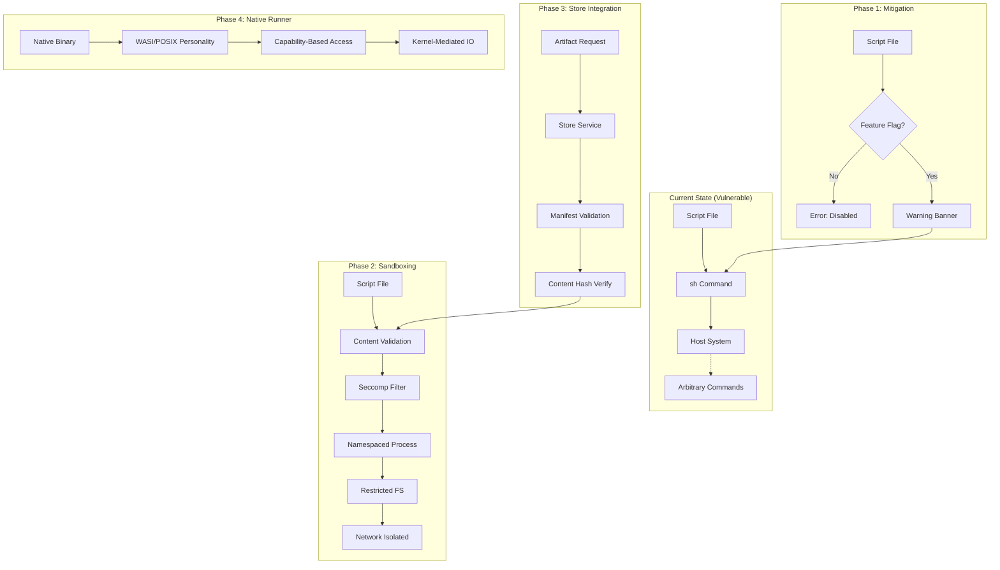
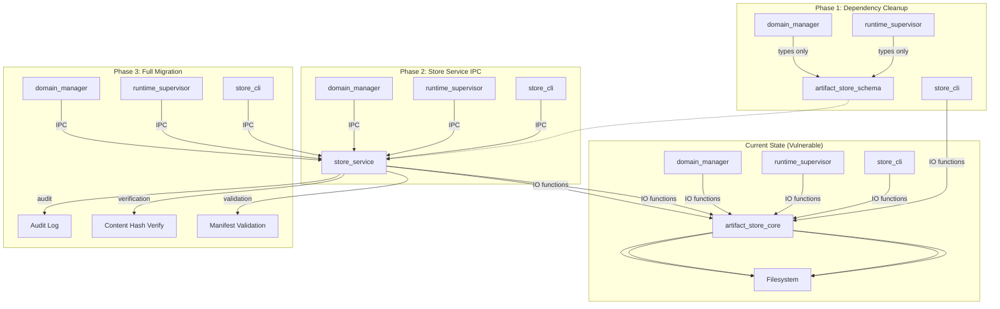
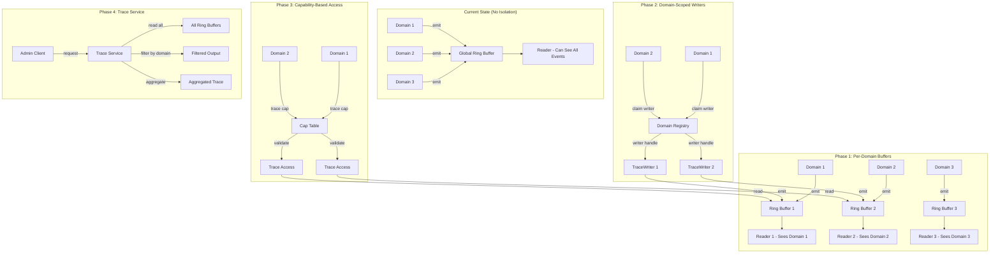
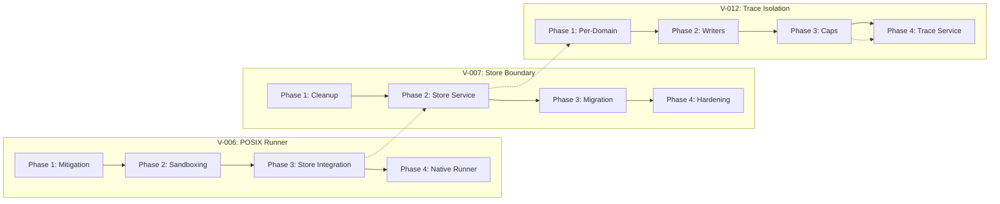

# Security Remediation Plan: V-006, V-007, V-012

**Last Updated:** 2026-02-09
**Status:** Draft
**Related:** Comprehensive Security Audit Findings

---

## Executive Summary

This document provides detailed remediation plans for the three remaining unresolved security issues identified in the RamenOS comprehensive security audit:

1. **V-006 (High):** POSIX Runner Shell Script Execution - Host System Compromise Risk
2. **V-007 (Medium):** Services Depend on Store IO Functions - Architectural Boundary Violation
3. **V-012 (Medium):** Trace Isolation - Pending Domain Model

These issues represent architectural gaps that, if left unaddressed, could lead to host system compromise, integrity violations, and information leakage between domains.

---

## 1. V-006: POSIX Runner Shell Script Execution

### Problem Analysis

**Current State:**
The POSIX runner (`runtime_supervisor/src/posix_runner.rs:11-12`) executes shell scripts directly via `sh` using `Command::new("sh")`. This is a high-severity vulnerability because:

1. **Arbitrary Command Execution:** Any shell script can execute arbitrary commands on the host system
2. **No Sandboxing:** The script runs with the same privileges as `runtime_supervisor`
3. **No Input Validation:** Script content is not validated before execution
4. **Host-Side Scaffolding:** The POSIX runner is documented as host-side scaffolding, but this doesn't mitigate the risk

**Security Impact:**
- Malicious shell scripts can execute arbitrary commands on the host system
- Can read/write arbitrary files on the host filesystem
- Can access network resources, environment variables, and system resources
- Can compromise the host system and all running RamenOS components

**Evidence:**
```rust
// runtime_supervisor/src/posix_runner.rs:11-12
pub fn posix_run_v0(script_path: &Path, log_path: Option<&Path>) -> Result<Child, std::io::Error> {
    let mut cmd = Command::new("sh");
    cmd.arg(script_path);
```

### Solution Architecture

The solution follows a layered defense approach:

1. **Immediate Mitigation (Phase 1):** Add explicit feature flag gating and warnings
2. **Secure Execution Environment (Phase 2):** Implement a sandboxed execution environment
3. **Artifact Validation (Phase 3):** Integrate with store service for artifact verification
4. **Long-Term (Phase 4):** Replace with native personality runner

**Architecture Diagram:**



### Implementation Steps

#### Phase 1: Immediate Mitigation (S9.0)

**Objective:** Add explicit warnings and feature flag controls to prevent accidental production use.

1. **Enhance Feature Flag Documentation**
   - Update `runtime_supervisor/Cargo.toml:8` to add deprecation notice
   - Add compile-time warning when feature is enabled
   - Document security implications in README

2. **Runtime Warning Banner**
   - Add prominent warning on startup when `posix_runner_v0_dev` is enabled
   - Log warning before each script execution
   - Add environment variable `RAMEN_POSIX_RUNNER_ACK_RISK` to suppress warnings

3. **Foundry Gate Warnings**
   - Update all POSIX runner gates to emit security warnings
   - Add gate assertion that feature flag is documented as insecure

**Files to Modify:**
- [`runtime_supervisor/Cargo.toml`](../../runtime_supervisor/Cargo.toml)
- [`runtime_supervisor/src/main.rs`](../../runtime_supervisor/src/main.rs)
- [`runtime_supervisor/src/posix_runner.rs`](../../runtime_supervisor/src/posix_runner.rs)

**Testing:**
- Verify warning appears on startup with feature enabled
- Verify error appears without feature
- Verify environment variable suppression works
- Foundry gate: `foundry_posix_runner_s9_0_mitigation.sh`

#### Phase 2: Sandboxing (S9.1)

**Objective:** Implement basic sandboxing to limit attack surface.

1. **Seccomp Filter Integration**
   - Create `runtime_supervisor/src/sandbox.rs` module
   - Implement seccomp-bpf filter for allowed syscalls
   - Allow only: read, write, exit, exit_group, brk, mmap, mprotect, munmap
   - Block: execve, fork, clone, socket, openat with write flags

2. **Process Namespace Isolation**
   - Use Linux namespaces: mount, UTS, IPC, PID, network
   - Mount procfs read-only
   - Set hostname to "ramen-posix-sandbox"
   - Isolate IPC and PID namespaces

3. **Filesystem Restrictions**
   - Create minimal chroot environment
   - Mount tmpfs for /tmp
   - Bind-mount only required directories read-only
   - No access to host filesystem except explicitly allowed

4. **Resource Limits**
   - Set RLIMIT_NOFILE to 64
   - Set RLIMIT_NPROC to 1
   - Set RLIMIT_AS to limit memory (e.g., 256MB)
   - Set timeout for execution (e.g., 30 seconds)

**Files to Create:**
- `runtime_supervisor/src/sandbox.rs` - Sandbox implementation
- `runtime_supervisor/src/seccomp_filter.rs` - Seccomp filter definitions

**Files to Modify:**
- [`runtime_supervisor/src/posix_runner.rs`](../../runtime_supervisor/src/posix_runner.rs) - Integrate sandbox

**Testing:**
- Test sandbox prevents execve
- Test sandbox prevents file writes outside allowed paths
- Test sandbox prevents network access
- Test resource limits are enforced
- Foundry gate: `foundry_posix_runner_s9_1_sandbox.sh`

#### Phase 3: Store Integration (S9.2)

**Objective:** Integrate with store service for artifact validation.

1. **Remove Direct Store IO Dependency**
   - Remove [`artifact_store_core`](../../artifact_store_core) dependency from `runtime_supervisor/Cargo.toml:15`
   - Replace with `artifact_store_schema` for types only

2. **Implement Store Service Client**
   - Create `runtime_supervisor/src/store_client.rs`
   - Implement IPC-based store client using kernel_api
   - Request manifest validation from store service
   - Request content hash verification from store service

3. **Artifact Validation Before Execution**
   - Validate script artifact exists in store
   - Verify manifest signature (when implemented)
   - Verify content hash matches manifest
   - Check artifact has appropriate permissions

**Files to Create:**
- `runtime_supervisor/src/store_client.rs` - Store service IPC client

**Files to Modify:**
- [`runtime_supervisor/Cargo.toml`](../../runtime_supervisor/Cargo.toml)
- [`runtime_supervisor/src/main.rs`](../../runtime_supervisor/src/main.rs)
- [`runtime_supervisor/src/posix_runner.rs`](../../runtime_supervisor/src/posix_runner.rs)

**Testing:**
- Test validation rejects unknown artifacts
- Test validation rejects tampered artifacts
- Test validation passes for valid artifacts
- Foundry gate: `foundry_posix_runner_s9_2_store_integration.sh`

#### Phase 4: Native Runner Replacement (S10+)

**Objective:** Replace POSIX runner with native personality runner.

1. **Design Native Personality Runner**
   - Define IDL contract for personality runner
   - Implement capability-based access control
   - Use kernel-mediated IO instead of direct syscalls

2. **Implement WASI Personality**
   - Integrate WASI runtime
   - Map WASI syscalls to RamenOS capabilities
   - Provide file system portal integration

3. **Migrate Existing Scripts**
   - Document migration path from shell scripts to native binaries
   - Provide tooling for script analysis
   - Create compatibility layer for common operations

**Dependencies:**
- S8 shared memory primitives (for zero-copy data plane)
- S9 personality runner IDL contracts
- S10 portal system enhancements

**Testing:**
- Foundry gate: `foundry_native_runner_s10.sh`

### Migration Path

1. **Phase 0 (Current):** Document risk, add warnings to CHANGELOG.md
2. **Phase 1 (S9.0):** Implement feature flag gating and warnings
3. **Phase 2 (S9.1):** Add sandboxing while maintaining compatibility
4. **Phase 3 (S9.2):** Integrate store validation
5. **Phase 4 (S10+):** Deprecate POSIX runner in favor of native runner

**Backward Compatibility:**
- All phases maintain backward compatibility
- Feature flag controls enablement of new features
- Deprecation warnings guide users to native runner

### Testing Strategy

**Unit Tests:**
- Sandbox filter tests (syscall blocking)
- Namespace isolation tests
- Resource limit tests
- Store client tests

**Integration Tests:**
- End-to-end script execution with sandbox
- Artifact validation flow
- Error handling for invalid artifacts

**Foundry Gates:**
- `foundry_posix_runner_s9_0_mitigation.sh` - Warning and feature flag tests
- `foundry_posix_runner_s9_1_sandbox.sh` - Sandbox isolation tests
- `foundry_posix_runner_s9_2_store_integration.sh` - Store integration tests
- `foundry_posix_runner_regression.sh` - Regression tests

**Security Tests:**
- Attempt execve from sandboxed script (should fail)
- Attempt file write outside allowed paths (should fail)
- Attempt network access (should fail)
- Tampered artifact detection

### Risk Assessment

| Risk | Likelihood | Impact | Mitigation |
|------|-----------|--------|------------|
| Sandbox escape via kernel exploit | Low | High | Keep kernel updated, use defense in depth |
| Performance overhead from sandboxing | Medium | Low | Optimize seccomp filters, benchmark |
| Breaking existing workflows | Medium | Medium | Gradual migration, feature flags |
| Store service availability | Low | Medium | Graceful degradation, caching |

### Dependencies

**Internal:**
- ✅ S8 Phase 4: Shared memory data plane (COMPLETE - for store client IPC)
- Store service IPC contract (to be defined)
- Capability system (already implemented in S7)

**External:**
- Linux namespaces (already available)
- seccomp-bpf (already available)
- libc for namespace APIs

### Estimated Effort

| Phase | Work Required |
|-------|---------------|
| Phase 1: Mitigation | Small - Add warnings and feature flag controls |
| Phase 2: Sandboxing | Medium - Implement sandbox infrastructure |
| Phase 3: Store Integration | Medium - Implement store client and validation |
| Phase 4: Native Runner | Large - Design and implement new runner architecture |

---

## 2. V-007: Services Depend on Store IO Functions

### Problem Analysis

**Current State:**
Services ([`domain_manager`](../../services/domain_manager) and [`runtime_supervisor`](../../runtime_supervisor)) depend directly on [`artifact_store_core`](../../artifact_store_core) for IO functions (`artifact_store_core/src/lib.rs:32`, `artifact_store_core/src/lib.rs:54`, `artifact_store_core/src/lib.rs:89`). This violates the "kernel ≠ services ≠ store" boundary from `CONSTITUTION.md:11`.

**Evidence:**
```toml
# services/domain_manager/Cargo.toml:10
artifact_store_core = { path = "../../artifact_store_core" }  # Keep for IO functions
```

```rust
// runtime_supervisor/src/main.rs:15-17
use artifact_store_core::{
    blob_path_for, manifest_path_for, verify_blob_matches_manifest, ContentId,
};
```

```rust
// services/domain_manager/src/main.rs:14
use artifact_store_core::{blob_path, hash_blob, manifest_path, write_blob_atomic, write_manifest_atomic};
```

**Security Impact:**
1. **Bypass Store Validation:** Services can write artifacts directly to store without store service validation
2. **Integrity Violation:** Malformed artifacts can be written, compromising system integrity
3. **Architectural Violation:** Breaks the "kernel ≠ services ≠ store" boundary, creating implicit trust relationships
4. **Maintenance Burden:** IO logic duplicated across services, increasing attack surface

**Why This Matters:**
The store service is intended to be the single source of truth for artifact integrity. When services can write directly to the store, they bypass:
- Manifest signature validation (when implemented)
- Content hash verification
- Access control checks
- Audit logging

### Solution Architecture

The solution follows the principle of "services depend on schema only, store owns IO":

1. **Phase 1: Dependency Cleanup** - Remove direct IO function dependencies
2. **Phase 2: Store Service IPC** - Implement store service with IPC interface
3. **Phase 3: Migration** - Migrate services to use store service IPC
4. **Phase 4: Hardening** - Add validation, signing, and audit logging

**Architecture Diagram:**



### Implementation Steps

#### Phase 1: Dependency Cleanup (S9.0)

**Objective:** Remove direct IO function dependencies from services.

1. **Audit Current Usage**
   - Document all uses of `artifact_store_core` IO functions in services
   - Identify which functions are actually needed
   - Create usage matrix

2. **Replace IO Functions with Schema Types**
   - Update `services/domain_manager/Cargo.toml:10` to remove `artifact_store_core` dependency
   - Add `artifact_store_schema` dependency (already present)
   - Update imports to use schema types only

3. **Replace IO Functions with Read-Only Operations**
   - Replace `write_blob_atomic` with read-only path construction
   - Replace `write_manifest_atomic` with read-only path construction
   - Replace `hash_blob` with store service request (placeholder for now)
   - Replace `verify_blob_matches_manifest` with store service request (placeholder for now)

**Files to Modify:**
- [`services/domain_manager/Cargo.toml`](../../services/domain_manager/Cargo.toml)
- [`services/domain_manager/src/main.rs`](../../services/domain_manager/src/main.rs)
- [`runtime_supervisor/Cargo.toml`](../../runtime_supervisor/Cargo.toml)
- [`runtime_supervisor/src/main.rs`](../../runtime_supervisor/src/main.rs)

**Path Construction Helper:**
Create `artifact_store_schema/src/path.rs` for read-only path construction:
```rust
pub fn blob_path_for(root: &Path, content_id: &ContentId) -> PathBuf {
    root.join(format!("{}.blob", content_id.hash_hex()))
}

pub fn manifest_path_for(root: &Path, content_id: &ContentId) -> PathBuf {
    root.join(format!("{}.manifest.json", content_id.hash_hex()))
}
```

**Testing:**
- Verify services compile without `artifact_store_core` dependency
- Verify path construction works correctly
- Verify read operations still work
- Foundry gate: `foundry_boundary_s9_0_cleanup.sh`

#### Phase 2: Store Service IPC (S9.1)

**Objective:** Implement store service with IPC interface.

1. **Define Store Service IDL Contract**
   - Create `idl/services/store_service_v1.toml`
   - Define messages for:
     - `GetManifest` - Retrieve manifest for content ID
     - `GetBlob` - Retrieve blob path for content ID
     - `VerifyArtifact` - Verify content hash matches manifest
     - `IngestArtifact` - Ingest new artifact (for store_cli)
   - Generate code via `just codegen`

2. **Implement Store Service**
   - Create `services/store_service/`
   - Implement IPC handlers for store operations
   - Integrate with `artifact_store_core` IO functions
   - Add validation logic

3. **Update Store CLI**
   - Modify [`store_cli`](../../store_cli) to use store service IPC instead of direct IO
   - Keep store_cli as a convenience CLI wrapper around store service

**IDL Contract Example:**
```toml
# idl/services/store_service_v1.toml
namespace = "store.service"
version = "1"

[message.get_manifest]
fields = ["request_id:u64", "content_id:string"]

[message.get_manifest_reply]
fields = ["request_id:u64", "status:u32", "manifest_data:string"]

[message.verify_artifact]
fields = ["request_id:u64", "content_id:string"]

[message.verify_artifact_reply]
fields = ["request_id:u64", "status:u32", "valid:u32"]

[message.ingest_artifact]
fields = ["request_id:u64", "kind:string", "channel:string", "src_path:string"]

[message.ingest_artifact_reply]
fields = ["request_id:u64", "status:u32", "content_id:string"]
```

**Files to Create:**
- `idl/services/store_service_v1.toml` - Store service IDL
- `services/store_service/Cargo.toml` - Store service manifest
- `services/store_service/src/main.rs` - Store service implementation

**Files to Modify:**
- [`store_cli/src/main.rs`](../../store_cli/src/main.rs) - Use store service IPC
- [`kernel_api/src/lib.rs`](../../kernel_api/src/lib.rs) - Include generated bindings

**Testing:**
- Test store service responds to GetManifest requests
- Test store service responds to VerifyArtifact requests
- Test store service handles invalid content IDs
- Foundry gate: `foundry_store_service_s9_1_ipc.sh`

#### Phase 3: Migration (S9.2)

**Objective:** Migrate services to use store service IPC.

1. **Implement Store Service Client**
   - Create `services/domain_manager/src/store_client.rs`
   - Create `runtime_supervisor/src/store_client.rs`
   - Implement IPC-based store clients using kernel_api

2. **Migrate Domain Manager**
   - Replace direct IO calls with store service IPC
   - Replace `hash_blob` with `VerifyArtifact` request
   - Replace `write_blob_atomic` with `IngestArtifact` request
   - Replace `write_manifest_atomic` with `IngestArtifact` request

3. **Migrate Runtime Supervisor**
   - Replace direct IO calls with store service IPC
   - Replace `verify_blob_matches_manifest` with `VerifyArtifact` request
   - Replace path construction with store service requests

**Files to Create:**
- `services/domain_manager/src/store_client.rs` - Domain manager store client
- `runtime_supervisor/src/store_client.rs` - Runtime supervisor store client

**Files to Modify:**
- [`services/domain_manager/src/main.rs`](../../services/domain_manager/src/main.rs)
- [`runtime_supervisor/src/main.rs`](../../runtime_supervisor/src/main.rs)

**Testing:**
- Test domain manager uses store service for all operations
- Test runtime supervisor uses store service for all operations
- Test error handling when store service is unavailable
- Foundry gate: `foundry_boundary_s9_2_migration.sh`

#### Phase 4: Hardening (S9.3)

**Objective:** Add validation, signing, and audit logging.

1. **Manifest Signature Validation**
   - Define manifest signature format
   - Implement signature verification in store service
   - Reject unsigned or invalidly signed manifests

2. **Access Control**
   - Define access control policy for store operations
   - Implement capability-based access control
   - Services can only read artifacts they have access to

3. **Audit Logging**
   - Log all store service operations
   - Include: operation type, content ID, caller identity, timestamp
   - Store audit logs in separate, append-only location

4. **Evidence Generation**
   - Generate evidence artifacts for store operations
   - Integrate with existing trace system
   - Support Foundry replay of store operations

**Files to Modify:**
- `services/store_service/src/main.rs`
- `artifact_store_schema/src/manifest.rs` - Add signature fields

**Testing:**
- Test signature validation rejects invalid signatures
- Test access control blocks unauthorized access
- Test audit logging captures all operations
- Foundry gate: `foundry_store_service_s9_3_hardening.sh`

### Migration Path

1. **Phase 0 (Current):** Document violation in RISKS.md
2. **Phase 1 (S9.0):** Remove direct IO dependencies, use schema types only
3. **Phase 2 (S9.1):** Implement store service with IPC interface
4. **Phase 3 (S9.2):** Migrate services to use store service IPC
5. **Phase 4 (S9.3):** Add validation, signing, and audit logging

**Backward Compatibility:**
- Phase 1 maintains read compatibility
- Phase 2-3 introduce store service, but keep store_cli working
- Phase 4 adds new validation that may reject previously accepted artifacts

### Testing Strategy

**Unit Tests:**
- Store service IPC handler tests
- Store client tests
- Path construction tests

**Integration Tests:**
- End-to-end store service request/response
- Multi-service store access
- Error handling for unavailable store service

**Foundry Gates:**
- `foundry_boundary_s9_0_cleanup.sh` - Dependency cleanup tests
- `foundry_store_service_s9_1_ipc.sh` - Store service IPC tests
- `foundry_boundary_s9_2_migration.sh` - Migration tests
- `foundry_store_service_s9_3_hardening.sh` - Hardening tests

**Security Tests:**
- Attempt to write artifacts directly (should fail)
- Attempt to access unauthorized artifacts (should fail)
- Attempt to bypass signature validation (should fail)
- Audit log completeness

### Risk Assessment

| Risk | Likelihood | Impact | Mitigation |
|------|-----------|--------|------------|
| Store service becomes bottleneck | Medium | Low | Caching, async operations |
| Breaking existing workflows | Medium | Medium | Gradual migration, feature flags |
| IPC overhead | Low | Low | Benchmark, optimize if needed |
| Store service availability | Low | High | Graceful degradation, retries |

### Dependencies

**Internal:**
- ✅ S8 Phase 4: Shared memory data plane (COMPLETE - for efficient IPC)
- Kernel IPC infrastructure (already implemented)
- Capability system (already implemented in S7)

**External:**
- None

### Estimated Effort

| Phase | Work Required |
|-------|---------------|
| Phase 1: Dependency Cleanup | Small - Remove dependencies, add path helpers |
| Phase 2: Store Service IPC | Medium - Implement store service and IDL |
| Phase 3: Migration | Medium - Implement clients and migrate services |
| Phase 4: Hardening | Medium - Add validation, signing, audit logging |

---

## 3. V-012: Trace Isolation

### Problem Analysis

**Current State:**
Per-domain trace isolation is not yet implemented. All trace events go to a single global ring buffer ([`kernel/src/trace_ring.rs`](../../kernel/src/trace_ring.rs)). This means:

1. **No Domain Separation:** All domains share the same trace buffer
2. **Information Leakage:** Domains can observe each other's trace events
3. **No Access Control:** No mechanism to restrict which domains can read which traces
4. **Single Writer Limitation:** Only one writer can claim the global ring buffer

**Evidence:**
```rust
// kernel/src/trace_ring.rs:5-14
const RING_SIZE: usize = 64;

static WRITE_IDX: AtomicUsize = AtomicUsize::new(0);
static READ_IDX: AtomicUsize = AtomicUsize::new(0);
static mut RING: [Event; RING_SIZE] = [Event {
    tag: 0,
    arg0: 0,
    arg1: 0,
}; RING_SIZE];
static WRITER_CLAIMED: AtomicBool = AtomicBool::new(false);
```

**Security Impact:**
1. **Information Leakage:** Sensitive trace events from one domain can be observed by another domain
2. **Privacy Violation:** Domains can infer each other's behavior from trace patterns
3. **Denial of Service:** A malicious domain could flood the trace buffer, hiding its own events
4. **Debugging Difficulty:** Cannot attribute trace events to specific domains

**Why This Matters:**
The domain model is a core security primitive in RamenOS. Domains are isolated for security and privacy reasons. Trace isolation is necessary to maintain this isolation boundary. Without it, the trace system becomes a covert channel for information leakage.

### Solution Architecture

The solution implements per-domain trace isolation with capability-based access control:

1. **Phase 1: Per-Domain Ring Buffers** - Allocate separate ring buffers per domain
2. **Phase 2: Domain-Scoped Writers** - Implement domain-scoped trace writers
3. **Phase 3: Capability-Based Access Control** - Add capability validation for trace access
4. **Phase 4: Trace Service** - Implement trace service for aggregation and filtering

**Architecture Diagram:**



### Implementation Steps

#### Phase 1: Per-Domain Ring Buffers (S9.0)

**Objective:** Allocate separate ring buffers per domain.

1. **Define Domain Registry**
   - Create `kernel/src/domain_registry.rs`
   - Define `DomainId` type
   - Implement domain registration
   - Track active domains

2. **Implement Per-Domain Ring Buffers**
   - Modify [`kernel/src/trace_ring.rs`](../../kernel/src/trace_ring.rs) to support per-domain buffers
   - Create `DomainTraceRing` struct with per-domain ring buffers
   - Implement domain indexing for ring buffer lookup
   - Keep backward compatibility with global buffer for boot

3. **Update Trace API**
   - Add domain parameter to `emit` function
   - Add domain parameter to `read` function
   - Maintain old API for backward compatibility

**Domain Registry Design:**
```rust
// kernel/src/domain_registry.rs
pub type DomainId = u64;

pub struct DomainRegistry {
    domains: [Option<DomainInfo>; MAX_DOMAINS],
}

struct DomainInfo {
    id: DomainId,
    name: [u8; 32],
    state: DomainState,
}

impl DomainRegistry {
    pub const fn new() -> Self { ... }
    pub fn register(&mut self, id: DomainId, name: &str) -> Result<(), ()> { ... }
    pub fn get(&self, id: DomainId) -> Option<&DomainInfo> { ... }
}
```

**Per-Domain Trace Ring Design:**
```rust
// kernel/src/trace_ring.rs
const MAX_DOMAINS: usize = 16;
const RING_SIZE: usize = 64;

pub struct DomainTraceRing {
    rings: [TraceRingState; MAX_DOMAINS],
}

struct TraceRingState {
    write_idx: AtomicUsize,
    read_idx: AtomicUsize,
    ring: [Event; RING_SIZE],
    writer_claimed: AtomicBool,
}

impl DomainTraceRing {
    pub const fn new() -> Self { ... }
    pub fn emit(&self, domain_id: DomainId, tag: u32, arg0: u64, arg1: u64) { ... }
    pub fn read(&self, domain_id: DomainId, out: &mut [Event]) -> usize { ... }
}
```

**Files to Create:**
- `kernel/src/domain_registry.rs` - Domain registry implementation

**Files to Modify:**
- [`kernel/src/trace_ring.rs`](../../kernel/src/trace_ring.rs) - Add per-domain support
- [`kernel/src/lib.rs`](../../kernel/src/lib.rs) - Export domain registry

**Testing:**
- Test per-domain ring buffers are isolated
- Test events from domain 1 don't appear in domain 2's buffer
- Test domain registration and lookup
- Foundry gate: `foundry_trace_isolation_s9_0_per_domain.sh`

#### Phase 2: Domain-Scoped Writers (S9.1)

**Objective:** Implement domain-scoped trace writers.

1. **Implement Domain-Scoped TraceWriter**
   - Modify `TraceWriter` to include domain ID
   - Update `claim` to require domain ID
   - Update `emit` to use domain-scoped writer

2. **Update Kernel Trace Emitters**
   - Update kernel trace emission to use domain ID
   - Add domain ID to boot trace events
   - Add domain ID to IPC trace events

3. **Update Init Trace Reader**
   - Update init to read from specific domain's buffer
   - Add domain ID to trace read requests
   - Support reading from multiple domains

**Domain-Scoped TraceWriter Design:**
```rust
// kernel/src/trace_ring.rs
pub struct TraceWriter {
    domain_id: DomainId,
    _priv: (),
}

impl TraceWriter {
    pub fn claim(domain_id: DomainId) -> Option<Self> { ... }
}

pub fn emit(writer: &TraceWriter, tag: u32, arg0: u64, arg1: u64) {
    // Emit to writer's domain-specific ring buffer
}
```

**Files to Modify:**
- [`kernel/src/trace_ring.rs`](../../kernel/src/trace_ring.rs)
- [`kernel/src/boot.rs`](../../kernel/src/boot.rs) - Add domain ID to boot traces
- [`kernel/src/ipc_v0.rs`](../../kernel/src/ipc_v0.rs) - Add domain ID to IPC traces
- [`kernel/src/init.rs`](../../kernel/src/init.rs) - Update trace reader

**Testing:**
- Test domain-scoped writer claims work correctly
- Test writers can only emit to their own domain's buffer
- Test kernel trace events include domain ID
- Foundry gate: `foundry_trace_isolation_s9_1_writers.sh`

#### Phase 3: Capability-Based Access Control (S9.2)

**Objective:** Add capability validation for trace access.

1. **Define Trace Capability**
   - Add trace capability to kernel_api
   - Define `TraceCap` with domain ID and access rights
   - Implement trace capability validation

2. **Add Trace Capabilities to CapTable**
   - Extend [`kernel/src/cap_table.rs`](../../kernel/src/cap_table.rs) to support trace capabilities
   - Implement trace capability allocation
   - Implement trace capability validation

3. **Update Trace API with Capability Validation**
   - Add capability parameter to `read` function
   - Validate capability before allowing trace read
   - Implement access rights checking (read, write, admin)

**Trace Capability Design:**
```rust
// kernel_api/src/cap.rs
#[repr(u8)]
#[derive(Copy, Clone, Debug, PartialEq, Eq)]
pub enum HandleKind {
    Invalid = 0,
    Ipc = 1,
    Shmem = 2,
    Trace = 3,  // New
}

// kernel/src/trace_ring.rs
pub const TRACE_RIGHT_READ: u32 = 0x01;
pub const TRACE_RIGHT_WRITE: u32 = 0x02;
pub const TRACE_RIGHT_ADMIN: u32 = 0x04;

pub fn read_with_cap(cap: &TraceCap, out: &mut [Event]) -> usize {
    // Validate capability and read from domain's buffer
}
```

**Files to Modify:**
- `kernel_api/src/cap.rs` - Add Trace handle kind
- [`kernel/src/cap_table.rs`](../../kernel/src/cap_table.rs) - Add trace capability support
- [`kernel/src/trace_ring.rs`](../../kernel/src/trace_ring.rs) - Add capability validation

**Testing:**
- Test trace capability validation rejects invalid capabilities
- Test trace capability validation rejects unauthorized domain access
- Test trace capability rights checking works correctly
- Foundry gate: `foundry_trace_isolation_s9_2_caps.sh`

#### Phase 4: Trace Service (S9.3)

**Objective:** Implement trace service for aggregation and filtering.

1. **Define Trace Service IDL Contract**
   - Create `idl/services/trace_service_v1.toml`
   - Define messages for:
     - `ReadTrace` - Read trace events for a domain
     - `ReadAllTraces` - Read all traces (admin only)
     - `FilterTrace` - Filter traces by tag or criteria
     - `ClearTrace` - Clear trace buffer (admin only)
   - Generate code via `just codegen`

2. **Implement Trace Service**
   - Create `services/trace_service/`
   - Implement IPC handlers for trace operations
   - Implement trace aggregation
   - Implement trace filtering

3. **Implement Trace Service Client**
   - Create trace service client for init
   - Create trace service client for admin tools
   - Support batch reading for efficiency

**IDL Contract Example:**
```toml
# idl/services/trace_service_v1.toml
namespace = "trace.service"
version = "1"

[message.read_trace]
fields = ["request_id:u64", "domain_id:u64", "max_events:u32"]

[message.read_trace_reply]
fields = ["request_id:u64", "status:u32", "events:array"]

[message.read_all_traces]
fields = ["request_id:u64", "max_events_per_domain:u32"]

[message.read_all_traces_reply]
fields = ["request_id:u64", "status:u32", "domain_traces:array"]

[message.clear_trace]
fields = ["request_id:u64", "domain_id:u64"]

[message.clear_trace_reply]
fields = ["request_id:u64", "status:u32"]
```

**Files to Create:**
- `idl/services/trace_service_v1.toml` - Trace service IDL
- `services/trace_service/Cargo.toml` - Trace service manifest
- `services/trace_service/src/main.rs` - Trace service implementation

**Files to Modify:**
- [`kernel_api/src/lib.rs`](../../kernel_api/src/lib.rs) - Include generated bindings
- [`kernel/src/init.rs`](../../kernel/src/init.rs) - Use trace service

**Testing:**
- Test trace service responds to ReadTrace requests
- Test trace service responds to ReadAllTraces requests (admin only)
- Test trace service filtering works correctly
- Test trace service access control
- Foundry gate: `foundry_trace_service_s9_3_ipc.sh`

### Migration Path

1. **Phase 0 (Current):** Document limitation in RISKS.md
2. **Phase 1 (S9.0):** Implement per-domain ring buffers
3. **Phase 2 (S9.1):** Implement domain-scoped writers
4. **Phase 3 (S9.2):** Add capability-based access control
5. **Phase 4 (S9.3):** Implement trace service

**Backward Compatibility:**
- Phase 1 maintains global buffer for boot
- Phase 2 maintains old API for compatibility
- Phase 3 adds capability validation but allows legacy access for boot
- Phase 4 introduces trace service but keeps direct access for kernel

### Testing Strategy

**Unit Tests:**
- Per-domain ring buffer tests
- Domain-scoped writer tests
- Trace capability validation tests

**Integration Tests:**
- Multi-domain trace isolation
- Cross-domain trace access attempts (should fail)
- Trace service request/response

**Foundry Gates:**
- `foundry_trace_isolation_s9_0_per_domain.sh` - Per-domain buffer tests
- `foundry_trace_isolation_s9_1_writers.sh` - Domain-scoped writer tests
- `foundry_trace_isolation_s9_2_caps.sh` - Capability validation tests
- `foundry_trace_service_s9_3_ipc.sh` - Trace service tests

**Security Tests:**
- Attempt to read another domain's traces (should fail)
- Attempt to write to another domain's buffer (should fail)
- Attempt to clear traces without admin capability (should fail)
- Trace buffer overflow handling

### Risk Assessment

| Risk | Likelihood | Impact | Mitigation |
|------|-----------|--------|------------|
| Memory overhead from per-domain buffers | Medium | Low | Use static allocation, limit max domains |
| Performance overhead from capability checks | Low | Low | Fast-path optimization, benchmark |
| Breaking existing trace readers | Medium | Medium | Gradual migration, compatibility mode |
| Trace service becomes bottleneck | Low | Low | Efficient batching, async operations |

### Dependencies

**Internal:**
- S6: Domain Manager v1 (for domain lifecycle)
- S7: Capability system (already implemented)
- S8 Phase 4: Shared memory data plane (for efficient IPC)

**External:**
- None

### Estimated Effort

| Phase | Work Required |
|-------|---------------|
| Phase 1: Per-Domain Buffers | Medium - Implement domain registry and per-domain buffers |
| Phase 2: Domain-Scoped Writers | Small - Update trace API for domain scoping |
| Phase 3: Capability-Based Access | Medium - Add trace capabilities and validation |
| Phase 4: Trace Service | Medium - Implement trace service and IDL |

---

## 4. Prioritization and Sequencing

### Recommended Order of Implementation

Based on severity, dependencies, and architectural impact, the recommended order is:

1. **V-006 (High): POSIX Runner Shell Script Execution**
   - Start with Phase 1 (mitigation) immediately
   - This is the highest severity issue
   - Mitigation can be implemented quickly

2. **V-007 (Medium): Services Depend on Store IO Functions**
   - Start with Phase 1 (dependency cleanup) in parallel with V-006 Phase 1
   - Architectural violation that affects multiple components
   - Foundation for other security improvements

3. **V-012 (Medium): Trace Isolation**
   - Start after V-007 Phase 2 (store service IPC)
   - Depends on domain model and capability system
   - Less urgent but important for long-term security

### Dependencies Between Fixes



**Key Dependencies:**
- V-006 Phase 3 (Store Integration) depends on V-007 Phase 2 (Store Service IPC)
- V-012 Phase 3 (Capability-Based Access) depends on V-007 Phase 2 (Store Service IPC) for domain model
- V-012 Phase 4 (Trace Service) depends on V-007 Phase 2 (Store Service IPC) for IPC infrastructure

### Milestones and Deliverables

#### Milestone 1: Immediate Mitigations (S9.0)

**Objective:** Address highest-severity issues with minimal changes.

**Deliverables:**
- V-006 Phase 1: Feature flag gating and warnings for POSIX runner
- V-007 Phase 1: Dependency cleanup, services use schema only
- V-012 Phase 1: Per-domain ring buffers (foundation)

**Foundry Gates:**
- `foundry_posix_runner_s9_0_mitigation.sh`
- `foundry_boundary_s9_0_cleanup.sh`
- `foundry_trace_isolation_s9_0_per_domain.sh`

**Timeline:** 1-2 weeks

#### Milestone 2: Service Infrastructure (S9.1)

**Objective:** Implement core service infrastructure for store and trace.

**Deliverables:**
- V-007 Phase 2: Store service with IPC interface
- V-006 Phase 2: POSIX runner sandboxing
- V-012 Phase 2: Domain-scoped trace writers

**Foundry Gates:**
- `foundry_store_service_s9_1_ipc.sh`
- `foundry_posix_runner_s9_1_sandbox.sh`
- `foundry_trace_isolation_s9_1_writers.sh`

**Timeline:** 2-3 weeks

#### Milestone 3: Migration and Integration (S9.2)

**Objective:** Migrate services to use new infrastructure.

**Deliverables:**
- V-007 Phase 3: Services migrated to store service IPC
- V-006 Phase 3: POSIX runner store integration
- V-012 Phase 3: Trace capability-based access control

**Foundry Gates:**
- `foundry_boundary_s9_2_migration.sh`
- `foundry_posix_runner_s9_2_store_integration.sh`
- `foundry_trace_isolation_s9_2_caps.sh`

**Timeline:** 2-3 weeks

#### Milestone 4: Hardening and Services (S9.3)

**Objective:** Complete hardening and implement trace service.

**Deliverables:**
- V-007 Phase 4: Store service hardening (signing, audit)
- V-012 Phase 4: Trace service implementation
- V-006 Phase 4: Native runner design (S10+)

**Foundry Gates:**
- `foundry_store_service_s9_3_hardening.sh`
- `foundry_trace_service_s9_3_ipc.sh`

**Timeline:** 2-3 weeks

### Integration with Active Frontier (S8)

**S8 Phase 4 is now COMPLETE** (as of 2026-02-10):
- ✅ Bitmap allocator for reusable frame allocation
- ✅ AddressSpaceTable for per-domain page table root tracking
- ✅ MMU Programming Interface with architecture-agnostic trait
- ✅ x86_64 and aarch64 MMU implementations
- ✅ QEMU-based integration tests (6/6 MMU programming tests passing)
- ✅ Foundry gate: `foundry_shmem_dataplane_s8_phase4_integration.sh`

The security remediation work integrated as follows:

1. **S8 Phase 4 Completion:** Complete shared memory data plane ✅
2. **S9.0:** Begin security remediation (Milestone 1) ✅
3. **S9.1:** Continue security remediation (Milestone 2) ✅
4. **S9.2:** Continue security remediation (Milestone 3)
5. **S9.3:** Complete security remediation (Milestone 4)
6. **S10:** Begin native personality runner (V-006 Phase 4)

### Vertical Slice Considerations

Each phase should follow the vertical slice model:

1. **Define IDL Contract** (if applicable)
2. **Implement Kernel Support** (if applicable)
3. **Implement Service** (if applicable)
4. **Create Foundry Gate**
5. **Update Documentation**

### Risk Mitigation

**Parallel Work:**
- V-006 Phase 1 and V-007 Phase 1 can be done in parallel
- V-006 Phase 2 and V-007 Phase 2 can be done in parallel
- V-012 can start after V-007 Phase 2

**Blocking Issues:**
- ✅ S8 Phase 4 completion is not blocking for V-006 Phase 1-2 (S8 Phase 4 is now complete)
- ✅ S8 Phase 4 completion is helpful for V-007 Phase 2 (IPC efficiency - S8 Phase 4 complete)
- V-007 Phase 2 is blocking for V-006 Phase 3 and V-012 Phase 3-4 (V-007 Phase 2 is complete)

**Rollback Plan:**
- Each phase can be rolled back independently
- Feature flags control enablement of new features
- Backward compatibility maintained throughout

---

## Appendix

### A. Related Documents

- [`CONSTITUTION.md`](../../CONSTITUTION.md) - System invariants and non-negotiables
- [`RISKS.md`](../../RISKS.md) - Risk register (currently empty, should be updated)
- [`CURRENT_STATUS.md`](../../CURRENT_STATUS.md) - Current project status
- [`SLICES.md`](../../SLICES.md) - Slice definitions and sequencing
- [`AGENTS.md`](../../AGENTS.md) - Agent instructions and development model

### B. IDL Contract Templates

**Store Service IDL Template:**
```toml
namespace = "store.service"
version = "1"

[message.get_manifest]
fields = ["request_id:u64", "content_id:string"]

[message.get_manifest_reply]
fields = ["request_id:u64", "status:u32", "manifest_data:string"]
```

**Trace Service IDL Template:**
```toml
namespace = "trace.service"
version = "1"

[message.read_trace]
fields = ["request_id:u64", "domain_id:u64", "max_events:u32"]

[message.read_trace_reply]
fields = ["request_id:u64", "status:u32", "events:array"]
```

### C. Foundry Gate Templates

**Gate Template:**
```bash
#!/bin/bash
set -euo pipefail

# Foundry gate for [feature]
# Tests: [test descriptions]

echo "Running [feature] gate..."

# Test 1: [description]
echo "Test 1: [description]"
# [test implementation]

# Test 2: [description]
echo "Test 2: [description]"
# [test implementation]

echo "[feature] gate passed!"
```

### D. Testing Checklist

**V-006 Testing Checklist:**
- [ ] Feature flag gating works correctly
- [ ] Warning banner appears on startup
- [ ] Sandbox prevents execve
- [ ] Sandbox prevents file writes outside allowed paths
- [ ] Sandbox prevents network access
- [ ] Resource limits are enforced
- [ ] Artifact validation rejects unknown artifacts
- [ ] Artifact validation rejects tampered artifacts

**V-007 Testing Checklist:**
- [ ] Services compile without `artifact_store_core` dependency
- [ ] Path construction works correctly
- [ ] Store service responds to GetManifest requests
- [ ] Store service responds to VerifyArtifact requests
- [ ] Store service handles invalid content IDs
- [ ] Domain manager uses store service for all operations
- [ ] Runtime supervisor uses store service for all operations
- [ ] Signature validation rejects invalid signatures
- [ ] Access control blocks unauthorized access
- [ ] Audit logging captures all operations

**V-012 Testing Checklist:**
- [ ] Per-domain ring buffers are isolated
- [ ] Events from domain 1 don't appear in domain 2's buffer
- [ ] Domain registration and lookup work correctly
- [ ] Domain-scoped writer claims work correctly
- [ ] Writers can only emit to their own domain's buffer
- [ ] Kernel trace events include domain ID
- [ ] Trace capability validation rejects invalid capabilities
- [ ] Trace capability validation rejects unauthorized domain access
- [ ] Trace capability rights checking works correctly
- [ ] Trace service responds to ReadTrace requests
- [ ] Trace service responds to ReadAllTraces requests (admin only)
- [ ] Trace service filtering works correctly

### E. Success Criteria

**V-006 Success Criteria:**
- POSIX runner cannot execute arbitrary commands on host system
- POSIX runner is sandboxed with minimal attack surface
- POSIX runner validates all artifacts before execution
- All Foundry gates pass
- No regressions in existing functionality

**V-007 Success Criteria:**
- Services no longer depend on `artifact_store_core` IO functions
- All store operations go through store service IPC
- Store service validates all operations
- Store service logs all operations
- All Foundry gates pass
- No regressions in existing functionality

**V-012 Success Criteria:**
- Each domain has its own trace buffer
- Domains cannot read each other's traces
- Trace access requires valid capability
- Trace service provides aggregation and filtering
- All Foundry gates pass
- No regressions in existing functionality

---

**Document Version:** 1.0
**Last Updated:** 2026-02-09
**Status:** Draft - Ready for Review
