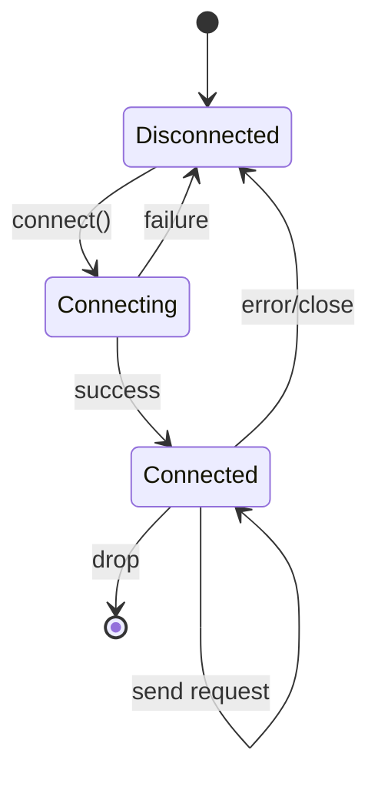
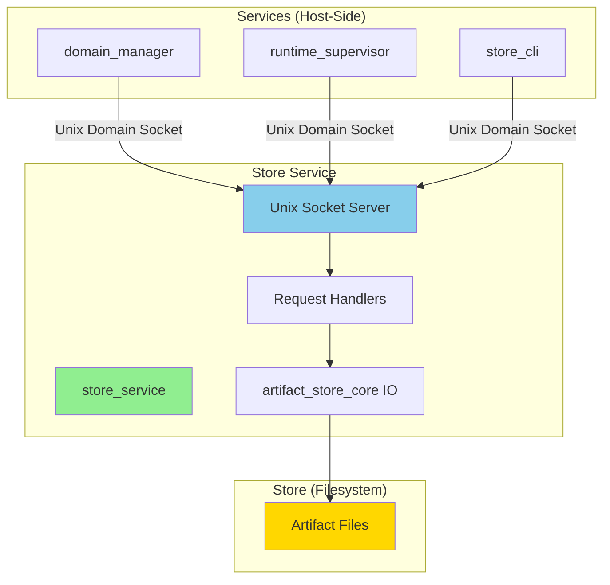

# V-007 Phase 2: Store Service IPC Design Document

**Date:** 2026-02-09
**Status:** Draft
**Related:** [`security_remediation_v006_v007_v012.md`](security_remediation_v006_v007_v012.md)

---

## Executive Summary

This document provides the design for V-007 Phase 2: Store Service IPC, which implements an IPC-based interface for the store service to enforce the "kernel ≠ services ≠ store" architectural boundary from `CONSTITUTION.md:11`.

The design recommends **Unix Domain Sockets** as the IPC transport mechanism, with a synchronous client library using **bincode** for serialization. This approach balances security, performance, and implementation complexity while aligning with existing RamenOS patterns.

---

## 1. IPC Transport Analysis

### 1.1 Unix Domain Sockets

**Pros:**
- **Security:** Filesystem permissions provide access control; can set owner/group/mode for socket files
- **Performance:** Low latency (no network stack overhead); efficient for local IPC
- **Proven Pattern:** Already used in RamenOS (`services/capsule_relay/src/vm_backend.rs:5` uses `UnixStream`)
- **Simplicity:** Well-understood API in Rust's `std::os::unix::net` module
- **No External Dependencies:** Part of standard library on Unix systems
- **Message Boundaries:** Preserves message boundaries (unlike TCP)
- **Credentials Passing:** Can pass Unix credentials (UID/GID/PID) for authentication

**Cons:**
- **Unix-Only:** Not portable to Windows (but RamenOS is Unix-focused)
- **Path Management:** Socket file paths must be managed (creation, cleanup)
- **Connection Model:** Stream-oriented (need framing protocol for messages)

### 1.2 Named Pipes (FIFOs)

**Pros:**
- **Unix Standard:** Available on all Unix systems
- **Simple API:** Basic file-like interface
- **No Network Stack:** Local-only communication

**Cons:**
- **No Connection Management:** No concept of connections; all writers see all data
- **No Access Control:** Limited permission model (cannot distinguish between multiple clients)
- **No Message Boundaries:** Byte stream only; requires framing
- **Single Reader/Writer:** Typically one reader, one writer (not suitable for multiple concurrent clients)
- **No Credentials Passing:** Cannot authenticate callers

### 1.3 Shared Memory with Kernel Mediation

**Pros:**
- **Highest Performance:** Zero-copy data transfer
- **Architectural Alignment:** Aligns with RamenOS "control plane = typed messages, data plane = zero-copy shared memory" principle
- **Future-Proof:** Could integrate with S8 shared memory primitives

**Cons:**
- **High Complexity:** Requires synchronization primitives, memory management, and coordination
- **Security Risks:** Memory corruption in one process can affect others; requires careful validation
- **Kernel Dependency:** Requires kernel mediation for safety (not yet available for host-side services)
- **Overkill for Store Service:** Store operations are not high-throughput data plane operations
- **Implementation Effort:** Would require significant new infrastructure

### 1.4 HTTP/REST API

**Pros:**
- **Universal Standard:** Well-understood protocol with extensive tooling
- **Language Agnostic:** Easy to implement clients in any language
- **Built-in Features:** HTTP provides status codes, content negotiation, etc.
- **Debugging:** Easy to debug with tools like curl, Postman

**Cons:**
- **Overhead:** HTTP headers, text-based (unless using HTTP/2 or HTTP/3)
- **Complexity:** Requires HTTP server implementation (hyper, actix-web, etc.)
- **Authentication:** Needs additional mechanism (tokens, certificates)
- **Architectural Mismatch:** HTTP is request/response over network; store service is local-only
- **Additional Dependencies:** Requires web framework and runtime

---

## 2. Recommended IPC Transport

### 2.1 Chosen Option: Unix Domain Sockets

**Justification:**

1. **Security with Minimal Complexity:** Unix domain sockets provide filesystem-based access control without requiring additional authentication infrastructure. Socket file permissions (mode 0600) restrict access to the owner, and credential passing can verify caller identity.

2. **Performance:** For local IPC, Unix domain sockets provide near-optimal performance with sub-millisecond latency. Store operations (manifest reads, blob path lookups) are not high-throughput, so performance is not a bottleneck.

3. **Proven Pattern in RamenOS:** The `services/capsule_relay/src/vm_backend.rs:5` path already uses `UnixStream` for VM communication, demonstrating this pattern works in the codebase.

4. **Implementation Simplicity:** Using `std::os::unix::net::UnixListener` and `UnixStream` requires minimal code. The framing protocol is straightforward (length-prefixed messages).

5. **No External Dependencies:** Everything needed is in the standard library, avoiding dependency bloat.

6. **Aligns with Architecture:** The store service is a host-side service; Unix domain sockets are the standard mechanism for local service communication on Unix systems.

### 2.2 Security Considerations

| Threat | Mitigation |
|--------|------------|
| Unauthorized access | Socket file permissions (mode 0600); only processes with appropriate UID/GID can connect |
| Impersonation | Use `UnixStream::peer_cred()` to verify caller UID/GID; reject connections from unexpected users |
| Message tampering | Length-prefixed framing prevents partial reads; bincode serialization includes type information |
| Denial of service | Set socket timeouts; limit concurrent connections; validate message sizes |
| Path traversal | Validate socket path; use absolute path from configuration |

### 2.3 Performance Expectations

- **Latency:** < 1ms for typical operations (GetManifest, GetBlob, VerifyArtifact)
- **Throughput:** Not a concern for store operations (expected < 100 ops/sec)
- **Memory:** Minimal (message buffers ~1KB typical; large blobs use file paths, not inline)
- **CPU:** Negligible (bincode serialization is fast; no encryption overhead)

### 2.4 Implementation Complexity

| Component | Complexity | Notes |
|-----------|------------|-------|
| Socket server | Low | `UnixListener::bind()`, `accept()` loop |
| Framing protocol | Low | 4-byte length prefix + payload |
| Serialization | Low | `bincode` crate (already in ecosystem) |
| Client library | Low | Wrapper around `UnixStream` |
| Error handling | Medium | Need robust handling of connection failures, timeouts |

---

## 3. Client Library Design

### 3.1 API Specification

```rust
// services/store_service/src/client.rs

use anyhow::Result;
use std::path::Path;

/// Store service client for IPC communication
pub struct StoreClient {
    socket_path: PathBuf,
    stream: Option<std::os::unix::net::UnixStream>,
    timeout: std::time::Duration,
}

impl StoreClient {
    /// Connect to store service at the given socket path
    pub fn connect<P: AsRef<Path>>(socket_path: P) -> Result<Self>;

    /// Connect with custom timeout
    pub fn connect_with_timeout<P: AsRef<Path>>(
        socket_path: P,
        timeout: std::time::Duration,
    ) -> Result<Self>;

    /// Get manifest for a content ID
    pub fn get_manifest(&mut self, content_id: &str) -> Result<GetManifestReply>;

    /// Get blob path for a content ID
    pub fn get_blob(&mut self, content_id: &str) -> Result<GetBlobReply>;

    /// Verify artifact integrity
    pub fn verify_artifact(&mut self, content_id: &str) -> Result<VerifyArtifactReply>;

    /// Ingest a new artifact
    pub fn ingest_artifact(
        &mut self,
        kind: &str,
        channel: &str,
        src_path: &Path,
    ) -> Result<IngestArtifactReply>;

    /// Close the connection
    pub fn close(&mut self) -> Result<()>;
}
```

### 3.2 Error Handling Strategy

**Error Types:**

```rust
#[derive(Debug, thiserror::Error)]
pub enum StoreClientError {
    #[error("connection failed: {0}")]
    ConnectionFailed(#[from] std::io::Error),

    #[error("serialization failed: {0}")]
    SerializationFailed(#[from] bincode::Error),

    #[error("store service error: status={status}, message={message}")]
    ServiceError { status: u32, message: String },

    #[error("timeout after {0:?}")]
    Timeout(std::time::Duration),

    #[error("invalid response: {0}")]
    InvalidResponse(String),
}
```

**Error Handling Principles:**

1. **Use `anyhow::Result<T>`** for application-level error handling (consistent with `services/store_service/src/main.rs:12`)
2. **Distinguish transient vs permanent errors:** Connection failures are transient; invalid content IDs are permanent
3. **Include context:** Error messages should include operation type and relevant parameters
4. **Timeouts:** All operations should have configurable timeouts (default 30 seconds)
5. **Retry logic:** Client should automatically retry on transient failures (max 3 retries with exponential backoff)

### 3.3 Serialization Format

**Choice: bincode**

**Justification:**

1. **Binary Format:** Compact and fast to serialize/deserialize
2. **Type-Safe:** Works with Rust's `serde` derive macros
3. **No Schema Evolution Needed:** Store service is versioned (v1); breaking changes require new version
4. **Performance:** Significantly faster than JSON for small messages
5. **Ecosystem:** Well-maintained crate; widely used in Rust projects

**Message Format:**

```
[4 bytes: length (little-endian u32)]
[N bytes: bincode-serialized message]
```

**Example:**

```rust
use serde::{Deserialize, Serialize};

#[derive(Serialize, Deserialize, Debug)]
pub struct GetManifestRequest {
    pub request_id: u64,
    pub content_id: String,
}

#[derive(Serialize, Deserialize, Debug)]
pub struct GetManifestReply {
    pub request_id: u64,
    pub status: u32,
    pub schema_version: u32,
    pub content_id: String,
    pub size_bytes: u64,
    pub kind: String,
    pub channels: String,
    pub signatures: String,
}
```

### 3.4 Connection Management

**Connection Lifecycle:**



**Connection Pooling:**

- **Initial Design:** Single connection per client (simple; sufficient for low-throughput store operations)
- **Future Enhancement:** Connection pool for high-throughput scenarios (not needed for Phase 2)

**Reconnection Strategy:**

1. **On Error:** Close connection, return error to caller
2. **On Next Request:** Automatically reconnect (single attempt)
3. **Backoff:** If reconnection fails, return error; caller can retry with exponential backoff

**Timeout Handling:**

- **Read Timeout:** 30 seconds default (configurable)
- **Write Timeout:** 10 seconds default (configurable)
- **Connection Timeout:** 5 seconds default

---

## 4. Implementation Plan

### 4.1 Step 1: IPC Transport Implementation

**Objective:** Implement Unix domain socket server in store_service

**Tasks:**

1. **Add Dependencies**
   - Add `bincode` to [`services/store_service/Cargo.toml`](../../services/store_service/Cargo.toml)
   - Add `thiserror` for error types

2. **Implement Framing Protocol**
   - Create `services/store_service/src/frame.rs`
   - Implement `read_message()` and `write_message()` functions
   - Use 4-byte length prefix (little-endian u32)

3. **Implement Socket Server**
   - Add `Server` struct to [`services/store_service/src/main.rs`](../../services/store_service/src/main.rs)
   - Implement `bind()`, `accept()`, `handle_client()`
   - Use socket path from environment variable or default (`out/store_service.sock`)

4. **Implement Request Dispatch**
   - Map request types to handler methods
   - Use match on message type discriminator
   - Serialize and send replies

**Files to Create:**
- `services/store_service/src/frame.rs` - Framing protocol implementation

**Files to Modify:**
- `services/store_service/Cargo.toml` - Add dependencies
- `services/store_service/src/main.rs` - Implement socket server

**Testing:**
- Unit tests for framing protocol
- Integration test: start server, send request, verify reply
- Foundry gate: `foundry_store_service_ipc_transport.sh`

### 4.2 Step 2: Client Library Implementation

**Objective:** Implement reusable client library

**Tasks:**

1. **Create Client Module**
   - Create `services/store_service/src/client.rs`
   - Implement `StoreClient` struct with connection management

2. **Implement Client Methods**
   - `connect()` / `connect_with_timeout()`
   - `get_manifest()`, `get_blob()`, `verify_artifact()`, `ingest_artifact()`
   - `close()`

3. **Add Error Types**
   - Define `StoreClientError` enum
   - Implement `From` traits for error conversion

4. **Add Unit Tests**
   - Mock socket for testing
   - Test serialization/deserialization
   - Test error handling

**Files to Create:**
- `services/store_service/src/client.rs` - Client library implementation

**Files to Modify:**
- `services/store_service/Cargo.toml` - Export client library as public module

**Testing:**
- Unit tests for client methods
- Integration test: client connects to real server
- Foundry gate: `foundry_store_client_tests.sh`

### 4.3 Step 3: Domain Manager Integration

**Objective:** Migrate domain_manager to use store client

**Tasks:**

1. **Add Store Client Dependency**
   - Add `store_service` crate to [`services/domain_manager/Cargo.toml`](../../services/domain_manager/Cargo.toml)
   - Remove `artifact_store_core` dependency (keep only `artifact_store_schema`)

2. **Create Store Client Instance**
   - Initialize `StoreClient` in `main()`
   - Pass to functions that need store access

3. **Replace Direct IO Calls**
   - Replace `hash_blob()` with `ingest_artifact()`
   - Replace `write_blob_atomic()` with `ingest_artifact()`
   - Replace `write_manifest_atomic()` with `ingest_artifact()`
   - Replace `verify_blob_matches_manifest()` with `verify_artifact()`

4. **Update Error Handling**
   - Adapt to `StoreClientError`
   - Add graceful degradation if store service unavailable

**Files to Modify:**
- `services/domain_manager/Cargo.toml` - Update dependencies
- `services/domain_manager/src/main.rs` - Use store client

**Testing:**
- Verify domain_manager starts with store service
- Verify artifact ingestion works via IPC
- Verify verification works via IPC
- Foundry gate: `foundry_domain_manager_store_integration.sh`

### 4.4 Step 4: Runtime Supervisor Integration

**Objective:** Migrate runtime_supervisor to use store client

**Tasks:**

1. **Add Store Client Dependency**
   - Add `store_service` crate to [`runtime_supervisor/Cargo.toml`](../../runtime_supervisor/Cargo.toml)
   - Remove `artifact_store_core` dependency (keep only `artifact_store_schema`)

2. **Create Store Client Instance**
   - Initialize `StoreClient` in `main()`
   - Pass to runner modules

3. **Replace Direct IO Calls**
   - Replace `verify_blob_matches_manifest()` with `verify_artifact()`
   - Replace path construction with `get_blob()` calls

4. **Update Error Handling**
   - Adapt to `StoreClientError`
   - Add graceful degradation if store service unavailable

**Files to Modify:**
- `runtime_supervisor/Cargo.toml` - Update dependencies
- `runtime_supervisor/src/main.rs` - Use store client
- `runtime_supervisor/src/posix_runner.rs` - Use store client (if applicable)

**Testing:**
- Verify runtime_supervisor starts with store service
- Verify artifact verification works via IPC
- Foundry gate: `foundry_runtime_supervisor_store_integration.sh`

### 4.5 Step 5: Store CLI Integration

**Objective:** Migrate store_cli to use store client

**Tasks:**

1. **Add Store Client Dependency**
   - Add `store_service` crate to [`store_cli/Cargo.toml`](../../store_cli/Cargo.toml)
   - Remove `artifact_store_core` dependency (keep only `artifact_store_schema`)

2. **Update Ingest Command**
   - Replace direct IO with `ingest_artifact()`

3. **Update Validation Commands**
   - Replace direct IO with `verify_artifact()`

**Files to Modify:**
- `store_cli/Cargo.toml` - Update dependencies
- `store_cli/src/main.rs` - Use store client

**Testing:**
- Verify `store_cli ingest` works via IPC
- Verify `store_cli validate-*` commands work via IPC
- Foundry gate: `foundry_store_cli_ipc.sh`

### 4.6 Step 6: Foundry Gate Specification

**Objective:** Define comprehensive Foundry gates for IPC implementation

**Gate 1: IPC Transport (`foundry_store_service_ipc_transport.sh`)**
```bash
#!/bin/bash
# Test 1: Start store service
cargo run --bin store_service &
STORE_PID=$!
sleep 1

# Test 2: Verify socket exists
test -S out/store_service.sock || exit 1

# Test 3: Send GetManifest request (using netcat or custom test client)
# ... implementation ...

# Test 4: Verify response
# ... implementation ...

# Cleanup
kill $STORE_PID
```

**Gate 2: Client Library (`foundry_store_client_tests.sh`)**
```bash
#!/bin/bash
# Run client library unit tests
cargo test --package store_service --lib client

# Integration test with real server
cargo run --bin store_service &
STORE_PID=$!
sleep 1

cargo test --package store_service --lib client_integration

kill $STORE_PID
```

**Gate 3: Domain Manager Integration (`foundry_domain_manager_store_integration.sh`)**
```bash
#!/bin/bash
# Start store service
cargo run --bin store_service &
STORE_PID=$!
sleep 1

# Start domain_manager
cargo run --bin domain_manager -- --plan test_plan.json

# Verify domain_manager used store service (check logs)
grep "store_client: get_manifest" logs/domain_manager.log || exit 1

# Cleanup
kill $STORE_PID
```

**Gate 4: Runtime Supervisor Integration (`foundry_runtime_supervisor_store_integration.sh`)**
```bash
#!/bin/bash
# Start store service
cargo run --bin store_service &
STORE_PID=$!
sleep 1

# Start runtime_supervisor with test plan
cargo run --bin runtime_supervisor -- --plan test_plan.json

# Verify runtime_supervisor used store service (check logs)
grep "store_client: verify_artifact" logs/runtime_supervisor.log || exit 1

# Cleanup
kill $STORE_PID
```

**Gate 5: End-to-End (`foundry_store_service_e2e.sh`)**
```bash
#!/bin/bash
# Start store service
cargo run --bin store_service &
STORE_PID=$!
sleep 1

# Ingest test artifact
cargo run --bin store_cli -- ingest --src test_file.bin

# Verify artifact
cargo run --bin store_cli -- verify --content-id <id>

# Use artifact in domain_manager
cargo run --bin domain_manager -- --plan test_plan.json

# Cleanup
kill $STORE_PID
```

---

## 5. Migration Strategy

### 5.1 Backward Compatibility Approach

**Phase 1: Coexistence (No Breaking Changes)**
- Store service runs alongside existing direct IO
- Services can use either direct IO or IPC
- Feature flag to enable IPC mode

**Phase 2: Soft Migration**
- Default to IPC mode
- Fallback to direct IO if store service unavailable
- Log warnings for direct IO usage

**Phase 3: Hard Migration**
- Remove direct IO code paths
- Require store service to be running
- Fail fast if store service unavailable

**Implementation:**

```rust
// Feature flag in Cargo.toml
[features]
default = ["store_ipc"]
store_ipc = ["store_service"]
store_direct = ["artifact_store_core"]

// Conditional compilation in domain_manager
#[cfg(feature = "store_ipc")]
use store_service::StoreClient;

#[cfg(feature = "store_direct")]
use artifact_store_core::{hash_blob, write_blob_atomic, write_manifest_atomic};
```

### 5.2 Rollback Plan

**If IPC Implementation Fails:**

1. **Immediate Rollback:** Disable `store_ipc` feature, enable `store_direct`
2. **Revert Dependencies:** Remove `store_service` dependency, restore `artifact_store_core`
3. **Code Reversion:** Git revert to pre-IPC commit

**Rollback Triggers:**
- Foundry gates consistently fail
- Performance degradation > 2x
- Security vulnerabilities discovered
- Unacceptable increase in complexity

### 5.3 Testing Strategy

**Unit Tests:**
- Framing protocol tests (edge cases, malformed messages)
- Client library tests (connection, serialization, error handling)
- Server handler tests (request dispatch, reply generation)

**Integration Tests:**
- Client-server communication
- Multiple concurrent clients
- Error scenarios (timeout, connection failure)
- Large messages (blob paths with long paths)

**End-to-End Tests:**
- Full workflow: ingest → verify → use
- Cross-service integration (domain_manager + runtime_supervisor)
- Foundry gate execution

**Performance Tests:**
- Latency benchmarks (GetManifest, GetBlob, VerifyArtifact)
- Throughput benchmarks (concurrent requests)
- Memory usage profiling

**Security Tests:**
- Unauthorized access attempts
- Message tampering
- Credential passing verification
- Path traversal attempts

---

## 6. Architecture Diagram



---

## 7. Protocol Specification

### 7.1 Message Format

All messages follow this format:

```
[4 bytes: length (little-endian u32)]
[N bytes: bincode-serialized payload]
```

### 7.2 Message Types

| Type | Request | Reply | Description |
|------|---------|-------|-------------|
| 1 | GetManifest | GetManifestReply | Retrieve manifest for content ID |
| 2 | GetBlob | GetBlobReply | Get blob file path for content ID |
| 3 | VerifyArtifact | VerifyArtifactReply | Verify artifact integrity |
| 4 | IngestArtifact | IngestArtifactReply | Ingest new artifact |

### 7.3 Request/Reply Structures

```rust
// Common to all messages
pub type RequestId = u64;

// GetManifest (Type 1)
pub struct GetManifestRequest {
    pub request_id: RequestId,
    pub content_id: String,
}

pub struct GetManifestReply {
    pub request_id: RequestId,
    pub status: u32,  // 0=OK, 1=NOT_FOUND, 2=INVALID_CONTENT_ID
    pub schema_version: u32,
    pub content_id: String,
    pub size_bytes: u64,
    pub kind: String,
    pub channels: String,
    pub signatures: String,  // JSON array as string
}

// GetBlob (Type 2)
pub struct GetBlobRequest {
    pub request_id: RequestId,
    pub content_id: String,
}

pub struct GetBlobReply {
    pub request_id: RequestId,
    pub status: u32,  // 0=OK, 1=NOT_FOUND, 2=INVALID_CONTENT_ID
    pub blob_path: String,
}

// VerifyArtifact (Type 3)
pub struct VerifyArtifactRequest {
    pub request_id: RequestId,
    pub content_id: String,
}

pub struct VerifyArtifactReply {
    pub request_id: RequestId,
    pub status: u32,  // 0=OK, 1=NOT_FOUND, 2=INVALID_CONTENT_ID
    pub valid: u32,   // 0=invalid, 1=valid
}

// IngestArtifact (Type 4)
pub struct IngestArtifactRequest {
    pub request_id: RequestId,
    pub kind: String,
    pub channel: String,
    pub src_path: String,
}

pub struct IngestArtifactReply {
    pub request_id: RequestId,
    pub status: u32,  // 0=OK, 1=NOT_FOUND, 2=INVALID_CONTENT_ID, 3=IO_ERROR
    pub content_id: String,
    pub size_bytes: u64,
}
```

### 7.4 Status Codes

| Code | Name | Description |
|------|------|-------------|
| 0 | OK | Operation succeeded |
| 1 | NOT_FOUND | Artifact not found |
| 2 | INVALID_CONTENT_ID | Content ID format is invalid |
| 3 | IO_ERROR | Filesystem or IO error |
| 4 | VALIDATION_FAILED | Artifact validation failed |
| 5 | PERMISSION_DENIED | Permission denied |

---

## 8. Configuration

### 8.1 Environment Variables

| Variable | Default | Description |
|----------|---------|-------------|
| `RAMEN_STORE_SOCKET` | `out/store_service.sock` | Path to store service Unix socket |
| `RAMEN_STORE_ROOT` | `out/installed/artifacts` | Root directory for artifact storage |
| `RAMEN_STORE_TIMEOUT` | `30` | Request timeout in seconds |

### 8.2 Socket File Permissions

- **Mode:** 0600 (owner read/write only)
- **Owner:** Process user running store service
- **Group:** Process group

### 8.3 Logging

Store service logs should include:
- Connection events (accept, close, error)
- Request/response pairs (with request_id)
- Errors (with context)
- Performance metrics (optional, for debugging)

---

## 9. Future Enhancements

### 9.1 Short-Term (Post-Phase 2)

1. **Connection Pooling:** For higher throughput scenarios
2. **Async API:** Using `tokio::net::UnixStream` for async services
3. **Metrics:** Prometheus-style metrics for monitoring
4. **Health Check:** Dedicated health check endpoint

### 9.2 Medium-Term (V-007 Phase 4)

1. **Manifest Signature Validation:** Verify signatures before returning manifests
2. **Access Control:** Capability-based access control for different services
3. **Audit Logging:** Append-only audit log of all store operations
4. **Evidence Generation:** Generate evidence artifacts for Foundry replay

### 9.3 Long-Term (S8+)

1. **Shared Memory Data Plane:** Zero-copy blob transfers
2. **Kernel-Mediated IPC:** Integrate with kernel capability system
3. **Distributed Store:** Multi-node artifact storage
4. **Content-Addressed Storage:** Deduplication across artifacts

---

## 10. Risks and Mitigations

| Risk | Likelihood | Impact | Mitigation |
|------|-----------|--------|------------|
| Socket file permissions misconfigured | Low | High | Use explicit mode 0600; verify on startup |
| Connection timeout causes service unavailability | Medium | Medium | Implement retry with exponential backoff |
| Bincode format changes break compatibility | Low | High | Version protocol; use explicit version field |
| Performance degradation vs direct IO | Low | Medium | Benchmark before/after; optimize if needed |
| Store service becomes single point of failure | Medium | High | Implement graceful degradation; cache frequently accessed manifests |

---

## 11. Success Criteria

V-007 Phase 2 is complete when:

1. **IPC Transport:** Unix domain socket server implemented and tested
2. **Client Library:** Reusable client library with all operations
3. **Domain Manager Integration:** domain_manager uses store client for all operations
4. **Runtime Supervisor Integration:** runtime_supervisor uses store client for all operations
5. **Store CLI Integration:** store_cli uses store client for all operations
6. **Foundry Gates:** All gates pass consistently
7. **Documentation:** Design document, API documentation, and migration guide complete
8. **Backward Compatibility:** Feature flag allows rollback to direct IO
9. **Performance:** No > 2x performance degradation vs direct IO
10. **Security:** Socket permissions verified; credential passing implemented

---

## Appendix A: References

- [`CONSTITUTION.md`](../../CONSTITUTION.md) - RamenOS architectural principles
- [`STORE_SPEC.md`](../../STORE_SPEC.md) - Store specification
- [`security_remediation_v006_v007_v012.md`](security_remediation_v006_v007_v012.md) - Security remediation plan
- [`idl/services/store_service_v1.toml`](../../idl/services/store_service_v1.toml) - Store service IDL
- [`services/store_service/src/main.rs`](../../services/store_service/src/main.rs) - Store service implementation
- [`services/capsule_relay/src/vm_backend.rs`](../../services/capsule_relay/src/vm_backend.rs) - Unix socket example

---

## Appendix B: Example Code

### B.1 Framing Protocol Implementation

```rust
// services/store_service/src/frame.rs

use std::io::{Read, Write};

const MAX_MESSAGE_SIZE: usize = 16 * 1024 * 1024; // 16MB

pub fn read_message<R: Read>(reader: &mut R) -> anyhow::Result<Vec<u8>> {
    // Read length prefix
    let mut len_bytes = [0u8; 4];
    reader.read_exact(&mut len_bytes)?;
    let len = u32::from_le_bytes(len_bytes) as usize;

    // Validate length
    if len > MAX_MESSAGE_SIZE {
        anyhow::bail!("message too large: {} bytes", len);
    }

    // Read payload
    let mut payload = vec![0u8; len];
    reader.read_exact(&mut payload)?;

    Ok(payload)
}

pub fn write_message<W: Write>(writer: &mut W, payload: &[u8]) -> anyhow::Result<()> {
    // Validate length
    if payload.len() > MAX_MESSAGE_SIZE {
        anyhow::bail!("message too large: {} bytes", payload.len());
    }

    // Write length prefix
    let len_bytes = (payload.len() as u32).to_le_bytes();
    writer.write_all(&len_bytes)?;

    // Write payload
    writer.write_all(payload)?;

    Ok(())
}
```

### B.2 Client Method Example

```rust
// services/store_service/src/client.rs

impl StoreClient {
    pub fn get_manifest(&mut self, content_id: &str) -> Result<GetManifestReply, StoreClientError> {
        let request_id = self.next_request_id();
        let request = GetManifestRequest {
            request_id,
            content_id: content_id.to_string(),
        };

        let reply_bytes = self.send_request(1, &request)?;
        let reply: GetManifestReply = bincode::deserialize(&reply_bytes)?;

        if reply.request_id != request_id {
            return Err(StoreClientError::InvalidResponse(
                "request_id mismatch".to_string(),
            ));
        }

        Ok(reply)
    }

    fn send_request<T: Serialize>(
        &mut self,
        msg_type: u32,
        request: &T,
    ) -> Result<Vec<u8>, StoreClientError> {
        // Ensure connection
        self.ensure_connected()?;

        // Serialize request
        let payload = bincode::serialize(request)?;

        // Write message type and payload
        let mut msg = vec![msg_type as u8];
        msg.extend_from_slice(&payload);

        // Write to socket
        frame::write_message(self.stream.as_mut().unwrap(), &msg)?;

        // Read reply
        let reply_payload = frame::read_message(self.stream.as_mut().unwrap())?;

        Ok(reply_payload)
    }
}
```

---

**Document Version:** 1.0
**Last Updated:** 2026-02-09
**Author:** Architect Mode (Roo)
**Status:** Draft - Pending Review
